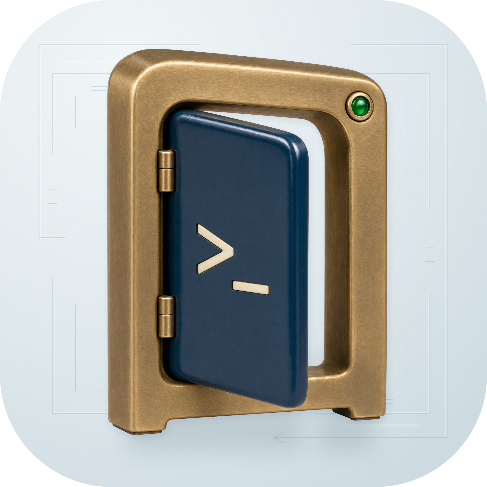
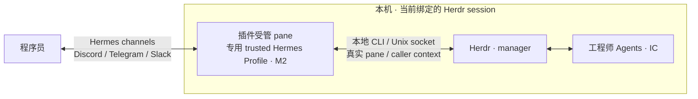
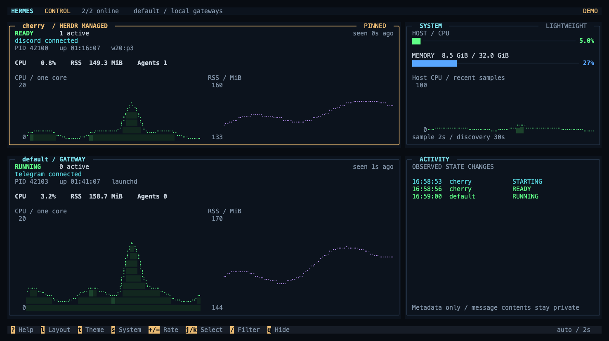

<p align="center">
  
</p>
<h1 align="center">hermes on herdr</h1>
<p align="center">把受信任的 Hermes 接入当前 Herdr，用熟悉的消息渠道管理你的 Agent 团队。</p>
<p align="center"><a href="docs/README.en.md">English</a> · <a href="docs/README.md">文档</a> · <a href="examples/README.md">配置示例</a> · <a href="video/README.md">双语产品短片</a></p>

**hermes on herdr** 是一个 Herdr 插件，把你显式选择的专用、受信任 Hermes Profile 直接链接到当前 Herdr session。它让该 Profile 的 Gateway 运行在受管 pane 中，获得真实的 pane、socket 与调用者（caller）上下文，以及该 session 的完整 Herdr 控制权限。这个 Hermes 是你的 M2：它管理 Herdr，Herdr 管理工程师 Agents。

Hermes 已有的 Discord、Telegram、Slack 等 channels 把你连接到这个 M2。配置好消息渠道后，你在外面也能向它交代任务、查询进度、调整工作，无需先 SSH 回机器、打开远程桌面，或为 Herdr 配置 VPN、暴露控制端口。消息走已有渠道，Herdr 控制连接留在本机。

## 为什么需要这个插件

你已经让 Codex、Grok、Pi、Claude Code 等工程师 Agent 在 Herdr 中协作。想再让 Hermes 管理 Herdr 时，缺口出现在控制上下文：一般在 Herdr 外独立运行的 Hermes，并不会天然处于目标 session 的受管 pane、socket 和 caller context 中。能给它发消息，并不代表它已经拥有可核对的 Herdr 身份、控制目标和进程归属。外部实例若要接入，这些关系需要另外建立和维护。

插件把这件事落实为显式绑定：你选择一个已有的 trusted Profile，绑定当前 owner session；Herdr 创建真实 plugin pane，插件核验归属，supervisor 在该 pane 中运行专用 Gateway 并传递控制上下文。专用 Hermes 因此能通过本地 Herdr CLI/API 管理这个 session，Gateway 的启停、暂停与恢复也有明确的责任方。

人与 M2 之间继续使用 Hermes 现成的消息渠道，省去日常远程管理时登录主机、接管桌面和维护控制隧道的步骤。本机、Herdr 与专用 Gateway 仍需在线，并能访问所选消息平台和模型服务；用户须配置 channel 凭据和允许访问的消息身份。各平台与端到端操作的实测范围见 [开发与验证](#开发与验证)。

## 架构与信任边界



- 绑定由用户显式选择的专用 Profile 和 owner socket 决定。安装插件不会给任意外部 Hermes 授权，也不会接管其他 Profile；插件启动与运行时会核验绑定、pane 归属和进程身份，拒绝不匹配的 owner 上下文。
- “完整控制”指绑定 session 的 Herdr API 控制权限。它仍受 Herdr 的本地 socket 访问权限、插件的归属校验和生命周期规则约束；暂停意图会持久保存，恢复必须显式执行。
- 远端消息入口复用 Hermes 的平台认证和访问策略。为专用 Profile 配置对应 channel 的用户允许列表或配对机制，仅让获授权的消息身份访问 M2；插件不会自动配置 bot、凭据或用户授权。
- Herdr 的 Unix socket 不向公网导出。Discord、Slack 的长连接及 Telegram 的轮询模式可连接已有消息服务，无需让用户设备直连 Herdr 主机。可选 HTTP 监控页也仅绑定 `127.0.0.1`，只读，不提供 Gateway 控制。

session 绑定限定的是插件的 owner、默认控制目标和受支持的操作范围，**不是操作系统沙箱**。Hermes 的 local terminal 仍拥有本机同 UID 的权限；Herdr socket 没有按 pane/Profile 划分的细粒度 ACL，Profile、提示词和 skill 不能强制阻止访问其他同 UID 资源。因此这里要求的是用户明确选择的 trusted Profile，不能把它当作运行不可信 Agent 的隔离容器。

实现与依据见 [上下文及 Profile 校验](src/hermes_gateway_herdr/config.py)、[Herdr 权限证据](docs/09-源码证据索引.md#h11)、[Hermes 平台实现](https://github.com/NousResearch/hermes-agent/tree/b7ac3ba1cdf89f94dfe86de27e01358b194f4053/plugins/platforms) 和 [安全与运维](docs/07-安全与运维.md)。

## 使用体验



- 启动时先显示专用 Gateway 的状态，按 **Enter** 打开完整监控；“以后自动打开”默认关闭，可用空格或鼠标保存选择。
- 监控面板展示多个 Hermes Profile 的状态、CPU、内存和进程趋势，突出 Herdr 专属实例。布局、主题、动画与采样频率均可调整，默认每两秒采样。
- `start`、`pause`、`resume`、`stop` 和 `restart` 管理 Gateway；`status`、`doctor` 和 `logs` 提供 JSON 诊断。
- supervisor 使用单例锁、身份核验、有界重试和熔断；遇到未知启动结果或仍存活的孤儿进程时，会先保留现场供诊断。

面板预览、快捷键和资源测量见 [监控面板指南](docs/14-hqtui监控面板.md)。

## 上手

**0.1.0** 使用 Herdr 原生插件安装器，版本与附件见 [GitHub Release](https://github.com/nocoo/hermes-on-herdr/releases/tag/v0.1.0)。[发布与安装](docs/15-发布与安装.md)说明接入、升级及版本约定；[首次关联方案](docs/16-首次安装与Profile关联.md)中的选择向导尚未实现，当前使用手动配置和 `bind`。

这是早期 0.x 版本，使用 Python 3.11+ 和已配置的 Hermes 虚拟环境。运行依赖是 [psutil 与 PyYAML](requirements.txt)，固定版本的 hqtui 源码随仓库提供。兼容基线固定为 Herdr v0.9.0、Hermes Agent v0.21.1；完整版本与提交见 [源码证据](docs/09-源码证据索引.md)。

```sh
herdr plugin install nocoo/hermes-on-herdr --ref v0.1.0
herdr plugin config-dir nocoo.hermes-gateway
herdr plugin list --plugin nocoo.hermes-gateway --json
```

进入列表返回的 `plugin_root` 后，`./bin/hermes-on-herdr --help` 和 `--version` 无需配置。接入前，按 [配置示例](examples/README.md) 准备目标 Herdr session、已有的专用 Hermes Profile 和私有配置目录。安装与接入步骤见 [发布与安装](docs/15-发布与安装.md)；Profile 的模型、凭据和平台由用户自行配置。安装不会下载 Python 依赖或接管已有 Gateway。

准备配置后，将下面的占位路径替换为实际 `config.json`：

```sh
./bin/hermes-on-herdr --config /absolute/config.json status --json
./bin/hermes-on-herdr --config /absolute/config.json doctor --json
./bin/hermes-on-herdr --config /absolute/config.json bind --dry-run
./bin/hermes-on-herdr --config /absolute/config.json dashboard
```

配置目录权限为 `0700`；`config.json` 和 `runtime-python` 为 `0600`。解释器提示文件只保存一行绝对路径，与配置的 `python_bin` 一致。

## 常用操作

以下命令均接在 `./bin/hermes-on-herdr --config /absolute/config.json` 后：

| 命令 | 行为 |
| --- | --- |
| `bind --dry-run` | 查看已有专用 Profile 的绑定计划；也是 `bind` 的默认行为 |
| `bind --apply` | 创建控制目录，初始暂停；随后显式 `start` 才允许运行 |
| `start` / `resume` | 保存运行意图并执行 ensure；收到 ACK 后仍需检查 READY |
| `pause` / `stop` | 先保存暂停意图，再通知 supervisor |
| `stop --wait 30` | 最多等待 30 秒，核验退出完成后报告结果 |
| `restart` | 对允许运行的实例请求重启，保留已有暂停意图 |
| `status --require-ready` | 仅在身份、运行状态及期望平台满足 READY 时成功 |
| `logs --lines 50` | 查看结构化生命周期事件 |
| `dashboard --startup` | 显示启动状态页，按需进入完整监控 |
| `dashboard --snapshot` / `dashboard --json` | 输出一次文本或 JSON 监控快照 |
| `dashboard --demo-profiles 2` | 使用合成数据预览双 Profile 面板 |
| `dashboard --http-port 8767` | 启动独立只读网页 `http://127.0.0.1:8767/` 与 `/health`；不控制 Gateway |

从 hook 外执行控制命令时，用全局 `--owner-socket /absolute/bound.sock` 指定绑定的 owner。全部参数、返回码与重试规则见 [命令契约](docs/12-离线实现与验证.md#124-当前命令契约)。

## 开发与验证

```sh
git clone https://github.com/nocoo/hermes-on-herdr.git
cd hermes-on-herdr
/absolute/path/to/hermes/venv/bin/python -I -B tests/run.py
```

测试使用临时目录、假 Herdr RPC、受控 Gateway 进程和真实 PTY，不调用已安装的 Herdr／Hermes 入口。最近保存的 [167 项离线测试](docs/evidence/release-0.1.0-unittest.txt) 覆盖生命周期竞态、macOS 退出身份读取、Linux 信号兼容、版本一致性、监控采样、终端交互和 HTTP 健康检查。[CI](.github/workflows/tests.yml)覆盖 Ubuntu / macOS 与 Python 3.11 / 3.14；资源测量见 [监控面板指南](docs/14-hqtui监控面板.md#146-测试与测量)。

cherry 已通过官方安装器安装 `v0.1.0` 并达到 READY；唯一 Gateway 的 Herdr/plugin 归属、Discord 连接为 cherry、嵌入终端监控和 HTTP 健康 200 均有[真实证据](docs/13-cherry接入与验证.md#137-正式-010-发布安装与运行验收)。Telegram、Slack 是 Hermes 上游已有渠道，当前尚无本插件对应的真实接入验收记录。新消息/模型往返、完整冷启动与退出清理、指定 pane 双向交互、Linux 真实接入和 Herdr 在线升级 handoff 仍待验证；此前用户确认的消息连通单独保留为历史记录。

## 文档

- [文档索引](docs/README.md)：按使用、开发和研究选择阅读路径，查看当前验证范围。
- [配置示例](examples/README.md)：解释器、专用 Profile、私有目录和绑定规则。
- [监控面板](docs/14-hqtui监控面板.md)：启动页、布局、快捷键、采样与性能。
- [安全与运维](docs/07-安全与运维.md)：权限、诊断、暂停和升级边界。
- [系统架构](docs/02-系统架构.md)与[生命周期](docs/03-生命周期设计.md)：controller、supervisor、锁和恢复协议。
- [品牌与标识](assets/brand/README.md)：Logo 用法、原始来源及 Hexly 展示。

品牌为 **hermes on herdr**，仓库和命令名为 `hermes-on-herdr`。内部标识与历史命名见 [文档约定](docs/README.md#命名约定)。
