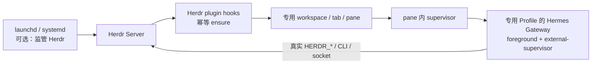

# hermes-gateway-herdr

让 Herdr 启动后自动确保一个专用 Hermes Gateway 运行在真实 Herdr pane 内，继承 `HERDR_SOCKET_PATH`、`HERDR_WORKSPACE_ID`、`HERDR_TAB_ID`、`HERDR_PANE_ID`，成为面向该 Herdr session 的控制 Agent。

**当前状态：设计／尚未实现。** 本仓库只包含中文可行性研究、架构和实施文档；没有可安装的 manifest、runtime 或发布包。本阶段没有创建或修改 Hermes Profile，没有安装插件，没有启动第二个 Gateway。

## 结论

**有约束可行（feasible with constraints）**。推荐所有权链：

- Herdr v0.9.0 支持 argv plugin pane 和真实环境注入；startup hook 仅是异步启动命令，不承担进程监督。[H03–H04](docs/09-源码证据索引.md#h03)
- 同一机器、同一 OS 用户的专用 Profile `herdr-control` 只绑定一个配置指定的 Herdr session；其他 session 的 hook 不争抢它。需要多个 Gateway 时必须分别配置 Profile、平台 token 和所有权。[架构决策](docs/08-决策记录.md)
- Hermes 指定版本已有 `gateway.sock`。身份响应、实时 status 和期望平台 connected 可组成最小 readiness probe；它仍不证明模型调用和消息端到端可用。[M10–M11](docs/09-源码证据索引.md#m10)
- 冷恢复不重放保存的普通 launch argv；live handoff 可以保留 PTY/process，但丢失 Herdr 内存中的 plugin ownership，且重跑 startup hooks。必须用锁、活身份和本插件账本去重，不能只按 pane label 判断。[H07–H09](docs/09-源码证据索引.md#h07)
- Stop/Pause 持久记录暂停，显式 Start/Resume 才清除；75 重启、1 重试、0 停止、2/78 熔断都要结合已持久化的意图判断。[生命周期](docs/03-生命周期设计.md)
- Herdr 崩溃时接受 Gateway 中断，Herdr 恢复后重建。handoff 后 supervisor 本身失效可能没有退出事件；无人值守、有恢复时限的模式还需要周期性短 ensure。原生服务管理下的 live handoff 在 spike 通过前不支持。[限制](docs/01-可行性分析.md)

Profile 是状态隔离，不是 sandbox。持有真实 Herdr socket 并能执行本地 terminal 命令的 Agent 具有同 UID 的广泛能力，persona 不能把它变成资源级硬隔离。[安全边界](docs/07-安全与运维.md)

## 文档

| 文档 | 内容 |
|---|---|
| [文档索引](docs/README.md) | 阅读顺序、证据等级和术语 |
| [01 · 可行性分析](docs/01-可行性分析.md) | 源码复核、prior art、替代方案、风险 |
| [02 · 系统架构](docs/02-系统架构.md) | 组件、所有权、协议、schema、状态机 |
| [03 · 生命周期设计](docs/03-生命周期设计.md) | ensure、恢复、重启、暂停、卸载算法 |
| [04 · Hermes 专用 Profile 设计](docs/04-Hermes专用Profile设计.md) | 初始化、配置、persona、skills、凭据 |
| [05 · 实现步骤](docs/05-实现步骤.md) | 先 spike，再按阶段实现和验收 |
| [06 · 测试与验证](docs/06-测试与验证.md) | 单元／集成／E2E／故障注入矩阵 |
| [07 · 安全与运维](docs/07-安全与运维.md) | 权限、日志、故障排查、OS 服务、升级 |
| [08 · 决策记录](docs/08-决策记录.md) | ADR 及推翻条件 |
| [09 · 源码证据索引](docs/09-源码证据索引.md) | commit、path、symbol、官方文档、GitHub 查询 |
| [10 · 实施任务清单](docs/10-实施任务清单.md) | P0/P1/P2、依赖和 DoD |
| [11 · 研究与验证记录](docs/11-研究与验证记录.md) | 实际执行的研究与文档检查、未执行项 |

## 固定基线

| 组件 | 版本 | 源码提交 |
|---|---|---|
| Herdr | 本机及 tag：v0.9.0 | [`b99002ac99b09e00b4ca692436cb15a6b0d676f1`](https://github.com/herdrdev/herdr/tree/b99002ac99b09e00b4ca692436cb15a6b0d676f1) |
| Hermes Agent | 本机：v0.21.1 (2026.9.7) | [`b7ac3ba1cdf89f94dfe86de27e01358b194f4053`](https://github.com/NousResearch/hermes-agent/tree/b7ac3ba1cdf89f94dfe86de27e01358b194f4053) |
| 官方文档 | 2026-09-11 在线抓取 | 非版本化；与源码不一致时明确列出差异 |

同类实现的六个本地 reference 和新发现候选也固定到 SHA，详见 [证据索引](docs/09-源码证据索引.md)。研究未发现满足全部目标的公开 exact plugin；搜索范围与限制已记录，不能据此证明不存在。

## 范围与非目标

目标宿主是 **Herdr plugin**：`herdr-plugin.toml` 注册外部命令、hooks、actions、panes。Hermes Python plugin 使用 `plugin.yaml` 并加载进 Hermes 进程；后续可作为受审计的辅助能力，本架构不依赖新增 Hermes plugin 管理生命周期。

首版面向 host macOS/Linux、单用户、单机、明确绑定的一个 session。Windows、跨机器 HA、热迁移 bot token、Herdr 不在时 Gateway 继续服务、对任意恶意本地代码的强隔离都不在首版范围。本阶段也不改变现有 Hermes integration、其他 Profile、系统服务或 reference 仓库。

仓库名 `hermes-gateway-herdr` 符合已观察到的 `<thing>-herdr` 命名惯例；拟定 manifest ID 为 `nocoo.hermes-gateway`，entrypoint 为 `gateway`，两者不要求与 repo 名相同。

下一轮从 [P0 spike](docs/05-实现步骤.md) 开始。文档里的拟实现命令和配置示例均有执行前提，不能视为当前可用产品。
