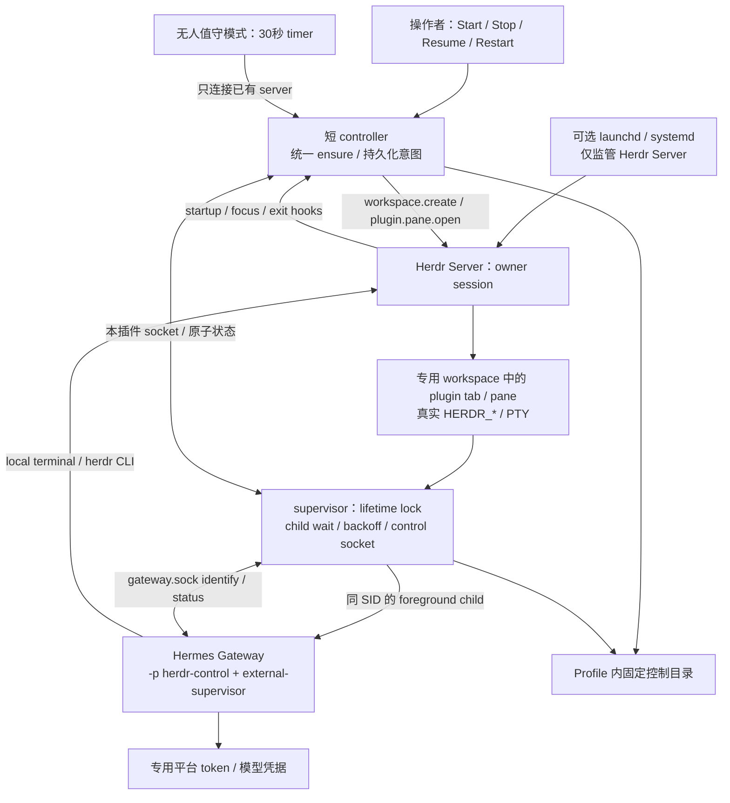
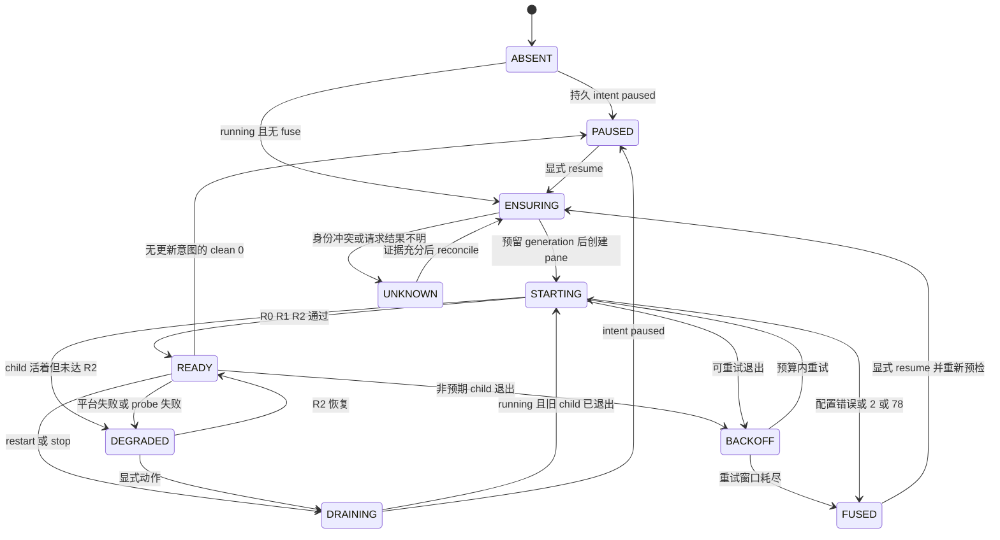
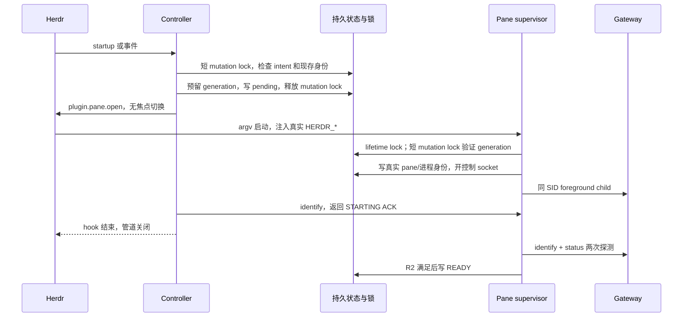

# 02 · 系统架构

本章是规范 P；已实现并通过离线测试的子集见 [12](12-离线实现与验证.md)，不能将规范全文视为已交付功能。固定版本和能力限制见 [01](01-可行性分析.md)，详细算法见 [03](03-生命周期设计.md)。

## 2.1 组件与所有权



| 组件 | 职责 | 禁止的职责混用 |
|---|---|---|
| Herdr Server | 创建 pane、PTY、真实环境、布局保存、handoff | 不假定会重启任意 argv pane [H04/H06](09-源码证据索引.md#h04) |
| controller | 读取 intent、串行化变更、识别／创建／协调旧实例、返回短 ACK | 不直接运行 Gateway、不持有 hook stdout 的后台服务 |
| pane supervisor | 唯一 lifetime owner、Gateway child 启停、活探测、日志、退避 | 不 setsid、不转交 native Hermes service、不修改 Profile 凭据 |
| Hermes Gateway | 平台适配、会话、模型及工具 | `--external-supervisor` 只让 restart 返回外部 owner [M06](09-源码证据索引.md#m06) |
| OS service/timer | 可选恢复 Herdr；无人值守模式提供短周期 reconcile | timer 不创建无 pane 的 Gateway，也不自动唤起未启动的 owner server |

拟用 Python3.11+ 实现少量模块。通过配置中明确的 Hermes venv interpreter 复用其 `psutil==7.2.2` 与 YAML 解析依赖；不另建 daemon 框架、数据库、队列或 Web 服务。[M16](09-源码证据索引.md#m16) launcher 只负责确定可信解释器和绝对入口后 exec；以隔离模式启动插件模块，禁用用户 Python 路径注入。解释器升级需要重新预检。

## 2.2 单例范围与资源组织

首版一个 OS 用户在一台机器上只有一个受本插件管理的 Profile：`herdr-control`。它绑定配置指定的 owner session，默认 `default`，不能“第一个启动的 session 获胜”。非 owner session 的 hook 返回 `NOT_OWNER`，不清 pause、不创建 workspace，也不夺取锁。[ADR-02](08-决策记录.md#adr-02)

绑定身份由以下字段组成：

```text
owner_key = SHA256(uid + canonical_owner_socket_path + canonical_profile_home)
```

编码使用带长度或固定 JSON 编码的字段，禁止直接无分隔拼接。canonical socket path 取已经验证的 parent realpath 加 basename；不把 live socket inode、Herdr PID、当前焦点或会随 handoff 改变的 PPID 放进稳定 key。启动记录另保存 boot fingerprint 和 OS process fingerprint，用来排除重启和 PID reuse。

Herdr plugin config/state 根不按 session 分区，且可随 XDG 环境移动。[H02](09-源码证据索引.md#h02) 真正的排他锁和 pause 锚定 **canonical Profile** 内固定目录，不能改成按 `HERDR_PLUGIN_STATE_DIR` 或 TMPDIR 分配互不相见的锁。

专用 workspace 默认 label `Hermes Control`，内部一个专用 tab `Hermes Gateway`、一个 argv plugin pane。第一次 `workspace.create --no-focus` 会产生初始 shell；先创建受监管 plugin tab，再核验并关闭本次创建且仍空闲的初始 shell，或保留为操作 pane。不能把初始 shell 当 Gateway，也不能为清爽布局关闭含用户工作的 pane。

workspace/tab/pane IDs 存入账本；label/cwd 只用于定位候选。复用需要 owner_key、generation、真实 pane membership、控制 socket 身份共同支持。若已有用户 workspace 恰好同名，不自动占用。跨 session 迁移必须先停旧 owner、确认两个 lifetime 都空闲，再显式修改 binding；不支持自动故障转移到其他 session。

## 2.3 Manifest 与安装目录契约

拟定 repo：`nocoo/hermes-gateway-herdr`；manifest ID：`nocoo.hermes-gateway`；pane entrypoint：`gateway`。根文件名 `herdr-plugin.toml`，min version 设 `0.9.0`。后续更高 Herdr 版本还需 runtime capability check，min version 不是经过测试的上界。[H01](09-源码证据索引.md#h01)

根目录已有[开发 manifest](../herdr-plugin.toml)，以下仅摘录其结构；尚未安装或经过真实 Herdr 验证：

```toml
id = "nocoo.hermes-gateway"
name = "Hermes Gateway"
version = "0.1.0-alpha.0"
min_herdr_version = "0.9.0"
platforms = ["macos", "linux"]

[[startup]]
command = ["./bin/hermes-gateway-herdr", "ensure", "--source", "startup"]

[[events]]
on = "workspace.focused"
command = ["./bin/hermes-gateway-herdr", "ensure", "--source", "event"]

[[events]]
on = "pane.exited"
command = ["./bin/hermes-gateway-herdr", "ensure", "--source", "event"]

[[events]]
on = "pane.closed"
command = ["./bin/hermes-gateway-herdr", "ensure", "--source", "event"]

[[panes]]
id = "gateway"
title = "Hermes Gateway"
placement = "tab"
command = ["./bin/hermes-gateway-herdr", "supervise"]

[[actions]]
id = "pause"
title = "Hermes Gateway: pause"
command = ["./bin/hermes-gateway-herdr", "pause"]
```

当前也注册了 start/resume/stop/restart/status/logs/doctor，全部进入同一个 dispatcher。只有一个 startup entry。hook argv 的入口相对 plugin root 解析；pane cwd 显式为 plugin root，launcher 再使用绝对模块路径。[H03/H04](09-源码证据索引.md#h03) launcher 使用 `/usr/bin/python3 -IS` 做纯标准库路径校验，再 exec 配置中的 Python 3.11+，保留 venv 路径并启用 `-I -B`。

## 2.4 Singleton source of truth

没有单个 PID 文件可以独自回答“该启动还是该杀谁”。按问题分别使用以下权威：

| 问题 | 权威 | 附加校验／冲突处理 |
|---|---|---|
| 是否允许运行 | 原子持久化 `intent.json` + `fuse.json` | paused/fused 优先于自动 ensure；损坏则 fail closed |
| 谁能变更 intent／预留 generation | 固定 inode 的 `mutation.lock` flock | 所有修改者，包括 supervisor，使用同一锁 |
| 是否已有 supervisor owner | 持有至退出的 `supervisor.lock` flock | held 但 socket 不通是 UNKNOWN，不能删锁或另起 |
| 该活 owner 是谁 | 本插件控制 socket 的 identify + nonce + OS fingerprint | 必须匹配 binding、当前 generation、UID 和真实 pane membership |
| 哪个 Gateway 属于它 | 直属 child handle + Hermes identify | PID/start_time/home/profile/code identity 必须匹配；同 SID |
| 是否有同 Profile／token 冲突 | Hermes `gateway.lock`、PID 与共享 token locks | 第二层防线；不能删文件、`--replace` 或改变 lockroot 绕过 [M09](09-源码证据索引.md#m09) |
| 旧 pane 是否可用／可关闭 | Herdr pane/process API + OS 身份 + 已持久化账本 | label、PID文件、socket路径存在都只算 hint |

PID fingerprint 格式要携带量纲：Linux 为 boot_id + `/proc/PID/stat` start ticks；macOS 为 boot fingerprint + psutil create_time。比较 Hermes identify 的 start_time 时按其 Linux ticks／其他 OS centiseconds 算法归一化；不能拿 ISO `started_at` 或 heartbeat 的 float 秒直接比较。[M09/M12](09-源码证据索引.md#m09)

## 2.5 目录和状态 schema

```text
<HERDR_PLUGIN_ROOT>/                  只读代码 checkout，更新时可替换
<HERDR_PLUGIN_CONFIG_DIR>/
  config.json                        无 secret，绝对 interpreter/hermes 路径、owner、Profile
  runtime-python                     一行绝对解释器路径；不作为 shell 脚本 source
<HERDR_PLUGIN_STATE_DIR>/
  diagnostics.json                   可丢缓存；不是单例锁或暂停的权威
<canonical HERMES_HOME>/
  config.yaml / .env / SOUL.md        由专用 Profile 管理
  memories/ sessions/ logs/ skills/   Hermes 自己的状态
  gateway.pid / gateway.lock / gateway_state.json / gateway.sock
  .herdr-gateway-herdr/
    binding.json                     安装实例及 owner 绑定
    intent.json                      持久意图和递增 revision
    mutation.lock                    永不原子替换、永不在线删除
    supervisor.lock                  同上，supervisor lifetime flock
    pending.json                     create RPC 的 generation 和阶段
    runtime.json                     活实例的可恢复线索
    fuse.json                        重试窗口、错误类别、熔断原因
    supervisor.sock                  本插件控制 socket
    logs/events.jsonl                无正文／secret 的结构化事件
    logs/gateway-output.log          私有 child 输出；不能直接公开导出
```

这些文件已在离线临时 fixture 中创建和测试，用户 Profile 没有被触碰。`bind --apply` 只初始化既有专用 Profile 的控制目录；缺 Profile 时返回诊断，不创建默认目录或回退默认 Profile。supervisor socket 过长时确定性地使用 `/tmp/hgh-<uid>-<owner_key前20位>/supervisor.sock`，校验私有目录与 socket，无需可变 pointer 文件。

`config.json` 当前字段：`schema=1`、`profile_id`、`profile_home`、`owner_session`、`owner_socket`、`herdr_bin`、`hermes_bin`、`hermes_root`、`python_bin`、`agent_cwd`、`plugin_root`、`expected_platforms`；未知字段会被拒绝。`config_dir` 从配置文件位置取得，恢复模式固定为 `next_owner_event`。路径全部绝对化，config 不含 API key 或 bot token。runtime-python 必须与 config 一致，权限不安全或格式错误时拒绝执行。[示例](../examples/config.example.json)

`intent.json` 示例（P；ID 为示意值）：

```json
{
  "schema": 1,
  "binding_id": "install-uuid",
  "revision": 12,
  "desired": "running",
  "action": "resume",
  "request_id": "request-uuid",
    "updated_at": 1789084800.0,
  "reason": "operator_resume",
  "maintenance_until": null
}
```

runtime 的必要字段，而非可以单独信任的健康证据：

```json
{
  "schema": 1,
  "owner_key": "sha256-of-binding",
  "generation": "generation-uuid",
  "instance_nonce": "random-128-bit-id",
  "applied_revision": 12,
  "state": "STARTING",
  "pane": {"workspace_id": "w-example", "tab_id": "tab-example", "pane_id": "pane-example", "terminal_id": "terminal-example"},
  "supervisor": {"pid": 1234, "start_fingerprint": {"kind": "os-specific", "boot": "boot-id", "value": "start-value"}, "sid": 1234},
  "gateway": {"pid": 1235, "start_fingerprint": null, "hermes_identify": null},
  "last_probe": null,
  "last_exit": null,
  "retry_at": null,
  "spawn_pending": false,
  "descendants": [],
  "ownership_source": "created"
}
```

上面是字段示意，不应手工生成 runtime；实际 OS 记录还含 UID、create_time、exe、argv 和 PPID。binding 保存 schema、binding_id、owner_key、Profile ID/home、UID 和稳定 socket；pending 保存 generation、intent revision、phase、RPC request id、controller 身份、creator nonce、已知 workspace/pane。持久时间采用 epoch 秒，当前进程超时采用 monotonic；pending 不因 TTL 到期自动作废。

Start/Resume 在同一次 intent 原子写中递增 `reset_revision`，只有比持久预算更新的显式 reset 才清除 fuse；避免“清 fuse”和“改 desired”两份文件的崩溃窗口。intent 保留最近64个请求 ID，显式 CLI request ID 必须配合 expected revision。spawn 前先写 `spawn_pending=true`；只有记录 child 身份后才清除，崩溃留下的未知 spawn 不能自动重试。

所有数据文件0600、私有目录0700，临时文件同目录 O_EXCL、flush/fsync 后 replace，再 fsync parent；lock 文件只 open+flock，不 replace。runtime snapshot 失败不得报告新的已持久化身份；暂停持久化失败不得 ACK 成功。[安全细节](07-安全与运维.md)

## 2.6 协议与接口

Herdr RPC 使用一行 JSON `id/method/params`，例：

```json
{"id":"create-generation-uuid","method":"plugin.pane.open","params":{"plugin_id":"nocoo.hermes-gateway","entrypoint":"gateway","placement":"tab","workspace_id":"w-example","cwd":"/absolute/plugin-root","focus":false,"env":{"HGH_OWNER_KEY":"binding-hash","HGH_GENERATION":"generation-uuid"}}}
```

实际结果从 `result.plugin_pane` 提取 ID；schema 见 [H05](09-源码证据索引.md#h05)。RPC id 用于关联响应，**不意味着 Herdr 服务端提供幂等去重**。不在 extra env 中设置 HERDR_* pane IDs，由 Herdr 覆盖并注入真实值。

本插件 socket 协议1请求：`protocol, id, verb, owner_key, generation, intent_revision`。当前只允许 `identify/status/stop/restart`，quiesce 尚未实现；不接收任意 argv、路径、signal number 或 shell 文本。响应包含 `ok/code/protocol/id/result`。变更请求必须引用最新持久 intent 的 revision 与 request ID，旧 generation／旧 revision 被拒绝；同一 revision 的重复请求只 ACK，不重复发信号。ACK 表示意图已接受，完成需查 status；`stop --wait SECONDS` 会等待并明确报告 `completed`。

socket0600、父目录0700；同 UID peer 检查采用可用的 OS 接口，结合 lstat 类型／owner 校验。nonce 是实例身份标识，不当作抵抗同 UID 攻击者的安全 token。每连接单请求，16 KiB 请求上限、64 KiB 响应上限；接收和写回各有 deadline，拒绝未知 verb/version。状态输出白名单，不透传整个 Hermes runtime、argv/env 或聊天正文。

命令退出码（本插件 P，区别于 Hermes child）：0=命令成功处理，含 PAUSED/NOT_OWNER/ACK；10=BUSY/PENDING/UNKNOWN；20=配置缺失／熔断／版本不支持；30=操作失败。`status --json` 输出稳定 schema，`status --require-ready` 仅 READY 为0；不能拿普通 status 的0判断服务 ready。hook 将忙与非 owner 归为短正常返回，详细原因写结构化日志。

## 2.7 Readiness 定义

| 层 | 必须满足 | 不足以证明的内容 |
|---|---|---|
| R0 supervisor alive | 插件 socket 新连接响应、nonce/generation/binding、UID/OS fingerprint、真实 pane membership 匹配 | child 存活／平台可用 |
| R1 gateway alive | Hermes identify protocol1、kind=hermes-gateway、canonical home、profile、直属 PID 和 start_time 一致；external；不服务额外 profiles | socket 在 adapter 之前启动，不能直接 ready |
| R2 operational ready | 两次相隔≥1秒的新请求：status answering_pid及顶层身份匹配；gateway_state=running；expected_platforms 非空且每项 state=connected、无 error_code/needs_attention；各平台 writer_pid/writer_start_time 匹配当前 child | running 写入早于 finish wiring；平台状态仍是观察值，不能保证下条消息成功 |
| R3 business verified | 测试账号发唯一 nonce，Gateway 返回同 nonce，并执行只读 Herdr 检查确认目标 session | 不代表未来永不失效或任意工具安全 |

协议 `identify/status` 来自 [M10](09-源码证据索引.md#m10)，runtime platform writer provenance 来自 `gateway/status.py:write_runtime_status`（794–842，见 [M11](09-源码证据索引.md#m11)）。每次校验 request id，status 的 answered_at 必须是本次响应，使用本地往返时间控制超时；不要依赖跨主机时钟。R2 对“专门服务 Herdr 的消息 Gateway”至少要求一个 expected platform；cron-only 不算 ready。

主探测不靠 `kill -0`、PID文件、日志关键词、socket路径存在或 heartbeat mtime。heartbeat30秒是诊断补充，量纲不能混用。[M12](09-源码证据索引.md#m12) socket 不可用但 lifetime/PID 活着时是 UNKNOWN，不得启动第二个实例；平台 retrying/fatal 的存活 Gateway 标 DEGRADED，不通过反复重启解决 token/网络问题。

## 2.8 状态机与预算



| 项目 | 初始默认值（P，spike 可调整） |
|---|---|
| mutation lock 等待 | hook 250 ms；交互命令最多2秒；锁内不等待进程 ready |
| Herdr / control RPC | 单次2秒；hook 总预算5秒，超时返回 PENDING |
| supervisor R0 / Gateway R2 | R0目标5秒内；R2最多90秒，之后仍活则 DEGRADED |
| 常规 probe / handoff grace | 每5秒一次；owner socket 暂失最多20秒，不按 PPID 判断死亡 |
| 自动 ensure timer | 无人值守模式30秒；仅连接已运行 owner server |
| crash 重试 | 1、2、4、8、16、30秒，上限30秒，±20% jitter；300秒内6次失败熔断 |
| 75 风暴 | 正常75最少1秒间隔；60秒内5次75熔断，包括 watchdog 来源 |
| 重置退避 | 连续 R2 ready 300秒；重试窗口持久化，不能靠 pane 重建重置 |
| Stop | TERM→最多25秒→KILL→最多5秒；每次信号前重验身份 |
| Restart | SIGUSR1；按配置 drain预算默认180秒+30秒余量；超时再走25+5秒终止；未证明旧 child 退出绝不 spawn |

所有等待使用 monotonic deadline、可被 pause/stop/owner-loss 打断。状态迁移日志与 metrics 使用同一 generation；未识别的新字段／版本不写回上游状态。

## 2.9 启动时序与信任边界



controller **不能持 mutation lock 等待 supervisor ready**：supervisor 也需要该锁确认 generation，否则会死锁。pending 充当释放锁后、RPC结果尚不明时的预留票据；完整失联算法在03。

信任边界有三层：远端消息先经平台 allowlist/pairing；模型输出进入本地工具授权策略；Herdr socket／本地进程受 OS UID 约束。前两层防误用，最后一层才是进程权限边界。裸 terminal 加真实 socket 无法强制只控制某个 workspace，也无法阻止读取其他 Profile；需求若升级为硬隔离，必须更换 OS 身份或引入受限 broker。[07](07-安全与运维.md)
