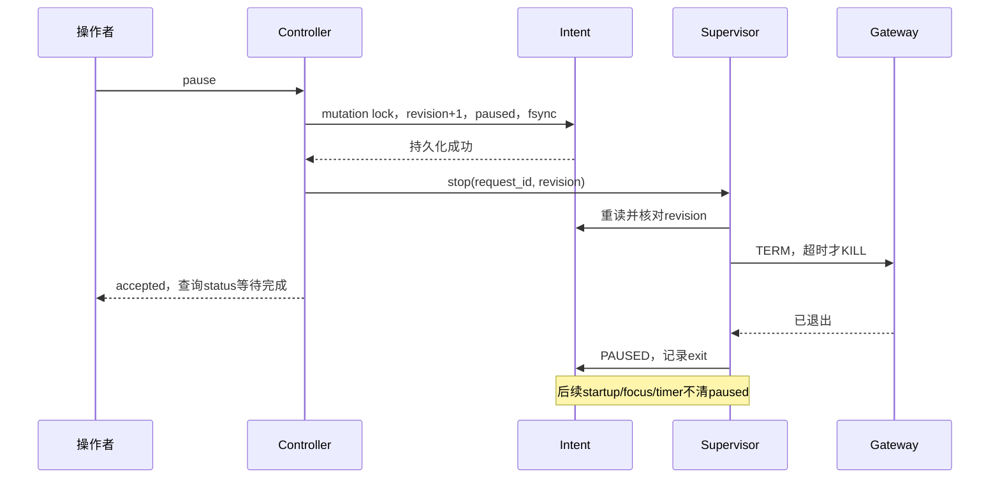

# 03 · 生命周期设计

本章是算法契约 P。锁、schema、超时、readiness 和退出码以 [02](02-系统架构.md) 为准；上游能力见 [H03–H13](09-源码证据索引.md#h03)、[M06–M12](09-源码证据索引.md#m06)。核心路径已有假 RPC/假进程验证，真实 Herdr/Hermes 场景未运行；实现子集及限制见 [12](12-离线实现与验证.md)。

## 3.1 必须维持的不变量

1. 每个 canonical Profile 至多一个本插件 lifetime owner，至多一个经验证的 Gateway child；发现不明活实例时宁可 UNKNOWN，不用新实例试探。
2. 未通过 owner session、Profile、UID、版本和配置预检，不创建 Gateway。真实 pane IDs 只能来自 Herdr 注入，不从 hook 焦点 context 复制。
3. 所有 intent、pending、runtime ownership 和 fuse 修改都经固定 `mutation.lock`。锁的 inode 在运行期间不变。
4. `intent.desired=paused` 是持久禁止自动启动。自动 ensure 不清 pause、不清 fuse、不修改绑定。
5. child 退出已确认、PID/start fingerprint 未发生变化、Hermes 冲突排查完成后，才可启动下一 child。ready 失败与进程已死是不同事实。
6. 删除／发信号／关闭 pane 都必须验证目标；label、旧 PID、旧 socket 文件或反序列化成功的 runtime 都不单独构成授权身份。
7. 所有等待有 deadline；hook 短时结束，异步长流程由 pane supervisor 承担。进程或磁盘失败不伪造成功 ACK。

## 3.2 首次配置到自动启动

首次初始化是显式操作，按 [04](04-Hermes专用Profile设计.md) 创建并配置新 Profile，然后写 binding 和初始 `intent=paused`。preflight 通过、操作者执行 start/resume 后才变 running。Herdr 插件安装和 startup 不自动复制凭据、创建 Profile 或安装 Hermes native service。

后续 owner Herdr Server 启动会执行唯一 startup entry；如果已有持久 running 意图则自动 ensure。如果没有初始化或 Profile 缺失，返回 `MISSING_PROFILE/SETUP_REQUIRED`，记录诊断并停止，不尝试默认 Profile。

基础事件来源是 startup、workspace.focused、pane.exited、pane.closed。退出／关闭事件只处理本账本或 pending 涉及的 pane；focus 可以检查 owner session 的全局实例。忽略自身创建引起的无关事件，并把同 revision 的频繁触发合并。H03 的异步 entry 和32并发上限意味着必须快速返回，不能用长 hook 承担轮询。

## 3.3 ensure 算法

### A · 无副作用预检

1. 从 Herdr 提供的路径读取插件配置，canonicalize Profile 和 owner socket；校验目录 owner/mode、无意外 symlink、支持版本、解释器和 Hermes 路径。
2. 当前 hook 的 `HERDR_SOCKET_PATH` 必须等于配置 owner；timer 明确传 owner socket。非 owner 返回 NOT_OWNER。不要用当前 workspace/pane 环境确定服务范围。
3. 确认 Profile 已存在、`-p` 会解析到该 home，采集配置是否可解析、model/provider是否明确、expected platforms声明以及同Profile service／multiplex冲突。运行配置错误阻止新的spawn，但不阻止读取既有pause、查询活身份或停止旧实例。预检不加载第三方插件、不解析输出中的 secret、不自动迁移配置。
4. 检查 Herdr socket 是本 UID 的 socket并请求只读 API。不可用则报告 `OWNER_UNAVAILABLE`；timer 不启动 Herdr，也不在 shell 外运行 Gateway。

### B · 短锁内决策

5. 获取 mutation lock；失败返回 BUSY。重读 binding、intent、fuse、pending、runtime，不能复用锁外缓存做变更决定。
6. paused：不创建；若仍有已验证 supervisor，安排它按最新 revision 停止。maintenance 尚有效：保持原实例，不创建。fused：返回诊断。
7. 对已有实例进行非破坏性快照判断；网络／控制 probe 可先在锁外完成，但锁内必须重新比较 revision/generation/关键身份。结果表如下。

| 观察 | 动作 |
|---|---|
| R0/R1/R2 和 pane 都匹配 | NOOP；必要时更新仅诊断时间 |
| supervisor/child 活，pane 存在，Herdr plugin ownership 丢失 | ADOPT 自己账本；不重启、不创建、不改凭据 |
| lifetime held，但 socket 不可验证 | UNKNOWN，释放 mutation lock 后有界等待；不偷锁 |
| pending 存在，R0 尚未出现 | PENDING；继续协调同 generation，不新建第二个 |
| runtime stale，PID 不存在或 fingerprint 已变且无其他 owner | 清理本插件陈旧缓存，保留证据摘要；进入候选 pane 核对 |
| 存活 Gateway 但无 supervisor | ORPHAN；只有完整身份成立才能协调停止并替换，见3.8 |
| 恢复空 shell、没有活 Gateway／lifetime owner | 依据3.7决定 replace 或保留；不能向 shell pane run |
| 无实例、无 pending、无冲突 | 预留新 generation，进入C |
| 多个活身份、不同 binding 或不明进程 | FUSED/OWNERSHIP_CONFLICT；不选择“看起来更新”的 PID 杀掉其他实例 |

### C · 预留、创建与提交

8. 在锁内写 `pending={generation, intent_revision, phase:reserved, request_id, owner_key}` 并 fsync。释放 mutation lock，**不跨 readiness 等待持锁**。
9. 复核 intent revision仍允许运行，查或创建专用 workspace。workspace.create 也有未知结果窗口；pending 的 phase 依次记录 `workspace_requested/workspace_known/pane_requested`。每一步只允许当前 generation 的发起者发送一次非幂等请求。
10. 调用 `plugin.pane.open`，placement=tab、focus=false、cwd=plugin root，仅用 extra env 传 HGH_OWNER_KEY/HGH_GENERATION。`id` 是关联键，不是 Herdr 服务端幂等键。
11. 新 supervisor 启动后先拿 lifetime lock，再短拿 mutation lock，校验 pending generation、intent revision/desired 和真实注入 IDs；失败则不启动 child。注册 runtime／R0 控制 socket，释放 mutation lock；成功后才能 spawn Gateway。
12. controller 在总5秒预算内检查 R0或状态。R0已出现返回 STARTING；没有出现返回 PENDING，并由后续 ensure/独立 timer继续核对。R2 的90秒 deadline由 supervisor 管理，hook不等待它。

### D · controller 中断或 RPC 响应丢失

13. 下次 ensure 首先查本插件 socket、lifetime lock、Hermes活身份、Herdr pane列表／process信息。已找到同 generation 的 supervisor就提交账本并移除相应 pending。
14. 创建失败有明确服务端错误且证明没有实例时，才能在锁内撤销 pending；下次创建使用新 generation。
15. 单纯 timeout、过期 reservation、controller PID死亡都不证明 pane 未创建。对未知结果先扫描并有界等待；若仍无法证明失败，设 `PENDING_UNKNOWN`，阻止自动再次创建并提供 doctor 诊断。人工清除也须先完成身份核查。

这不是跨两个进程的事务协议；它以“无法确认时停止创建”的代价保证不重复。不能用 reservation TTL 到期就无条件重发。

当前实现只有在 `reserved/workspace_known` 等发送前阶段、且确认旧 controller 已死时才接管票据。发送后的 timeout、协议错误和服务端错误都保守保留未知结果；服务端错误也不被假定为原子回滚。R0 已注册则直接核验原实例，无需重发创建。

### E · Pause → Resume 的 generation 撤销

Pause 先递增 revision 并写 paused。之后显式 Start/Resume 产生新 revision；ensure 在锁内确认无活 owner、无活 child/后代、无未知 `spawn_pending`，才替换旧 pending 为新 generation。新票据保留上一个撤销记录，已确认的专用 workspace 可以复用。

旧 controller 后续写入会因 generation/revision/creator 不匹配而失败；迟到的旧 pane 即使被 Herdr 创建，也无法通过 supervisor 的票据校验，不能启动 Gateway。自动 ensure 不递增 revision，不利用此机制绕过未知结果。`spawn_pending` 表示 Popen 的结果可能未记录，显式 Resume 也不能绕过它。

## 3.4 supervisor 算法

1. 校验 argv入口和已注入真实 HERDR_*；建立当前 OS PID/start fingerprint/SID、binding/generation/nonce。拿 lifetime flock，保持文件描述符直到所有 child 清理完成后退出。锁文件以 CLOEXEC 打开，child 不继承锁，否则会导致错误 owner 续命。
2. 在 mutation lock 内确认 running、无 fuse、pending有效；登记真实 pane、terminal、workspace、tab，开私有控制 socket。R0代表 supervisor可以响应，尚未代表 Gateway ready。
3. 预检专用 Profile；构造受控环境。每次spawn前再次短拿mutation lock，重读intent/generation，先记录 `spawn_pending`，再完成Popen并登记child后释放；不持锁等待ready。通过 argv 直接创建 `hermes -p herdr-control gateway run --external-supervisor`，同时显式设置 canonical HERMES_HOME。保持相同 SID；child stdin为 DEVNULL，stdout/stderr为独立读取管道，umask=077。Hermes 的 `gateway.lock` 使用普通 `open(a+)`，必须由 child umask 保证新文件私有。
4. 保存 child handle和OS fingerprint。读取 stdout/stderr使用持续排空、限量缓冲和轮转，避免满管道阻塞 Gateway；pane展示简短状态，raw输出只写私有日志。[07](07-安全与运维.md)
5. 用 selector／短任务调度同时处理控制请求、child wait、定时 probe和退出信号。不要在 signal handler 内做复杂 I/O；handler置位，由主循环优先持久化意图并处理。Python child returncode<0 表示 signal，不误作正数退出码。
6. 每次启动都执行 R1/R2；90秒后仍有活 child则 DEGRADED，继续观测 Hermes自己的 adapter reconnect，不仅因没ready就 kill。
7. child退出后记录 code/signal、运行时长、最新intent revision。先应用当前意图，再应用下表。所有重试前再验证 owner socket/pane，避免Herdr失联期间在孤儿环境内反复 spawn。

| child 结果 | 当前意图／判断 | 行为 |
|---|---|---|
| 任意结果 | paused或维护停机／owner离开 | 不重启；以当前 intent 为准 |
| 75 | running，未超75风暴预算 | 至少1秒后重启；支持 `/restart`、SIGUSR1、watchdog来源 |
| 1 或 SIGKILL等意外信号 | 无 profile/token ownership conflict，预算内 | 指数退避重试；记录退出原因 |
| 0 | 无比 child.applied_revision 更新的动作，且没有显式restart请求 | 在锁内持久写 paused，reason=observed_clean_exit；不自动复活 |
| 0 | 较新的restart/resume intent仍要求运行 | 尊重较新revision，不把旧child的结果覆盖到新意图 |
| 2 或78 | 任意自动触发 | FUSED，需要修复后显式resume；不循环 |
| 任意未知正数 | 来源未识别 | 默认FUSED，保留退出信息，新增分类需证据和测试 |
| 无退出，socket超时 | lifetime/child仍在 | UNKNOWN/DEGRADED；诊断，不能复制第二个Gateway |

同 Profile锁冲突可能给1，bad token可能存活degraded，corrupt CLI配置未必给2；按 [M08](09-源码证据索引.md#m08) 不把上述表误用为“只看整数”的循环。熔断窗口持久保留，supervisor重启不能把计数归零。

Stop/Pause、observed clean0、熔断或quiesce完成清理后，supervisor退出并释放lifetime；不为了显示PAUSED/FUSED保留另一个常驻空进程。普通pane随之关闭，handoff导入pane可能退回shell；状态和日志仍可从磁盘读取。Resume重新ensure新的受监管pane；在暂停尚未完成的短窗口中，较新Resume按revision协调，必须等旧child结束后才可再spawn。

## 3.5 Stop、Pause、Resume、Restart

| 动作 | 持久语义 | 运行时行为 |
|---|---|---|
| Stop | 写 paused，revision+1 | 停当前child；若实例不存在也成功保持暂停 |
| Pause | 与Stop相同 | 作为UI中更清楚的“保持停止”入口；MVP不做第三种临时stop |
| Start／Resume | 预检成功后显式清 pause/fuse，revision+1，running | ensure现有／新实例；配置错误未修复则仍阻断 |
| Restart | 仅在running时记录action=restart和revision | 同一supervisor向已验证child发SIGUSR1，等待退出后重启；paused时拒绝，不偷偷resume |
| Quiesce for maintenance（尚未实现） | 保留原desired，写有截止时间的maintenance | 先停child，避免升级／Herdr计划停机触发竞争；到期只恢复原running意图 |

Stop/Pause必须**先 atomic write + fsync，再发控制请求／信号**；这样controller在两步间崩溃，下一次ensure仍会停止，不会复活。ACK返回的是“意图已落盘”，status才是完成结果。停止时child和已确认后代 TERM→25秒→KILL→5秒；信号前再次校验PID/start fingerprint，无法确认则报告失败且保持paused。

停止动作只要求可验证的binding、可持久化intent和目标身份，不要求模型配置有效或平台ready；坏token、损坏的Hermes配置不能阻止安全Stop。binding/路径本身不可信时仍须拒绝任意终止，不靠绕过身份校验“救火”。

SIGUSR1由Hermes映射为service restart/drain。[M07](09-源码证据索引.md#m07) controller不调用通用 `hermes gateway restart`，它可能调用native service或在hook进程前台运行replacement。[M15](09-源码证据索引.md#m15) Hermes `pause-for-update`也是drain/restart，不用于sticky Pause。

正常Stop只承诺有界终止，不承诺所有长任务完成。需要先完成工作再退出时，操作者先等待 `active_agents=0` 和业务确认，再Stop；它也只是观察值。Restart给drain预算，超时后执行有界终止并标明forced，不能悄悄声称graceful。

直接关闭专用pane／workspace视为资源丢失，running intent可在下一次ensure重建。用户要保持停止应使用Stop/Pause。对supervisor的Ctrl+C可处理为显式pause；SIGHUP/SIGTERM因常用于Herdr退出不自动写pause，保留running用于恢复。直接执行外部 `hermes gateway stop` 且supervisor存活时会观察clean0并latch；若两者同时死亡，插件无法补写从未收到的用户意图，故不能对这条旁路作同等保证。

## 3.6 Live handoff adopt

Herdr把PTY交给新server、保留runtime，但plugin_panes登记不持久，startup又会执行。[H08/H09](09-源码证据索引.md#h08)

1. supervisor不以PPID改变判断死亡；owner socket暂时不可达进入20秒grace，不重启已活Gateway。新socket回来后核对稳定owner_key和pane membership。
2. 新startup controller连接已有supervisor，核对nonce/generation/OS fingerprint；用Herdr普通pane API确认真实workspace/tab/pane/terminal与SID进程关系。Gateway identify必须还是同PID/start_time/home。
   `terminal_id` 是运行时关联，不是跨 handoff 不变量：`restore.rs` 在接管 PTY 后重新分配 `TerminalId`。核对稳定的公开 pane/workspace/tab IDs 和原 supervisor 进程后，更新账本中的 terminal ID，不能因此重启健康实例。
3. 在短锁内仅更新自己的runtime，例如 `ownership_source=adopted_after_handoff`。不调用plugin.pane.open，不改变child PID，不假装回填Herdr表。
4. 后续focus/close在本账本验证后使用普通pane API。旧plugin.pane.focus/close报not-found是预期上游缺口，不是创建第二pane的理由。
5. 若pane被移动导致实际workspace/tab与Gateway继承环境不一致，不能把旧环境解释为“当前真实”；标 `ENV_STALE`，禁止自动控制新范围，协调停止后创建新generation。首版不承诺运行中移动专用pane的透明支持。
6. handoff后supervisor死亡可能退回shell并漏pane.exited，周期ensure补偿；未启timer的基础模式等下一次focus/startup，明确显示恢复等级。

## 3.7 Cold restore replace

冷恢复创建fresh shell/cwd/layout，不执行保存的普通argv。[H08](09-源码证据索引.md#h08) 算法先查活进程，**不因看见shell就认定旧Gateway已死**。

1. 若supervisor／Gateway仍活但恢复后的pane不对应它，走3.8孤儿协调；不得把它adopt成新shell的前台程序。
2. 如果无活owner，找到原账本的workspace/tab/pane/terminal、专用label/cwd等候选。核对当前shell PID/start、SID、前台进程和同session其他进程；采样两次确认没有用户作业。
3. stock API不能可靠证明“shell没有未提交输入”或“用户从未使用此pane”；仅PID空闲不够。自动关闭仅限有额外充分证据的本插件新建空壳。对冷恢复空壳默认保留并标记为retired；新建受监管plugin tab，确保原Profile仍至多一个Gateway。
4. 如果项目将来增加可靠的空壳判定spike，可在确认仅本次冷恢复且无人交互后关闭旧空壳；在此之前让操作者清理旧pane。不能以恢复便利为由自动关闭普通用户shell。
5. 创建新pane通过3.3预留协议。Herdr snapshot没保存原pane（debounce窗口）时也按absent处理，但仍检查canonical Profile的locks/socket/进程；不要依赖snapshot作为单例真相。

“replace”指运行所有权替换，不保证总能自动删掉旧UI空壳；系统最多保留额外shell，不能有第二个同ProfileGateway。

## 3.8 Supervisor crash、孤儿及 PID reuse

正常argv pane的supervisor退出通常让Herdr关闭pane并清理session；handoff后可能回shell，Herdr SIGKILL则没有Drop清理。[H06/H10](09-源码证据索引.md#h06)

**当前边界**：已实现 ORPHAN/UNKNOWN 识别和禁止替代启动；以下第3项的自动孤儿回收尚未实现。Pause 仍会持久禁止新启动，但不能声称已停止失去 supervisor 的活 child；`stop --wait` 对 ORPHAN 返回 `completed=false` 和退出码30。必须保留现场，以只读身份核查为下一步，不能手工删锁来恢复。

1. lifetime lock已释放但Hermes PID/identify仍活时，状态为ORPHAN。新supervisor不能“收养”为自己的Popen child；wait/信号/stdio关系不能通过写JSON恢复。
2. 只读扫描限本UID：canonical executable、精确argv token序列、Profile home、OS start fingerprint、旧generation/pane/SID关系。可以展示候选，不用宽泛进程名匹配直接杀。
3. 身份充分的旧实例先SIGUSR1请求drain或按显式stop TERM，确认旧Gateway和可归属后代已退出、lifetime和Hermes runtime锁不再由活进程占用，再replace新pane。无法确认时FUSED，要求人工核查。
4. `pid=旧值`但start fingerprint不同，视为PID复用；绝不发信号，仅移走本插件过期runtime缓存。不删除Hermes自己的锁/PID文件，由Hermes处理它的stale state。
5. 若目标在检查和kill间退出，ProcessLookupError按已退出处理；若fingerprint变化立即停止。Linux优先可用pidfd；macOS没有等价完整保证，重查与同UID信任模型仅降低竞态，不能声称抵抗恶意快速PID复用。

## 3.9 Herdr 退出与恢复

计划关闭：先quiesce或pause，等status确认child停止，再 `herdr server stop`。Herdr清理窗口只有若干250ms，不能依赖它提供长任务drain。[H10/H13](09-源码证据索引.md#h10)

非计划退出：supervisor收到HUP/TERM时进入stopping，不再spawn，清理自己child，保留原running意图。若未收到信号，owner socket/pane探测失败超过20秒后执行同样动作；短暂断连在此之前可恢复。watch 已用假 owner 断连和受控信号验证，真实 Herdr live handoff、退出清理时序仍须 spike。

Herdr由OS服务或用户重新启动后，startup确保running意图恢复。若新server先于旧supervisor完成退出，ensure等待／协调原实例，不抢Profile/token。休眠恢复、socket同路径重新创建、PID变化都重新核对membership；不能只靠相同路径认为同一次运行。

## 3.10 更新、禁用与卸载

1. 更新先写maintenance并停止child，保存旧版本和兼容schema快照，升级plugin代码／显式Hermes版本，再跑预检，最后按原desired恢复；失败则回滚代码和本插件schema，保持停止。
2. 卸载先持久pause，等待child和supervisor退出并确认lifetime释放。关闭有充分归属证据的专用pane，移除本插件timer；只移除本插件自行创建且仍指向本配置的OS资源。
3. 最后运行Herdr plugin disable/uninstall。上游unlink会删plugin_panes记录但让pane继续运行，卸载还会删checkout；先卸载再找supervisor是不可靠顺序。[H12](09-源码证据索引.md#h12)
4. 默认保留专用Profile、模型凭据、memory/sessions和pause tombstone；删除Profile是独立显式操作，不能作为插件卸载的附带动作。
5. 如果用户绕过推荐顺序直接disable/uninstall，ensure 检查 registry 后不新建；supervisor 发现明确 disabled/unlinked 时写 paused 并退出，短暂API失败只进入grace。该补偿已有离线测试，真实卸载尚未验证；本轮不提供自动卸载、升级或 service/timer 管理工具。
