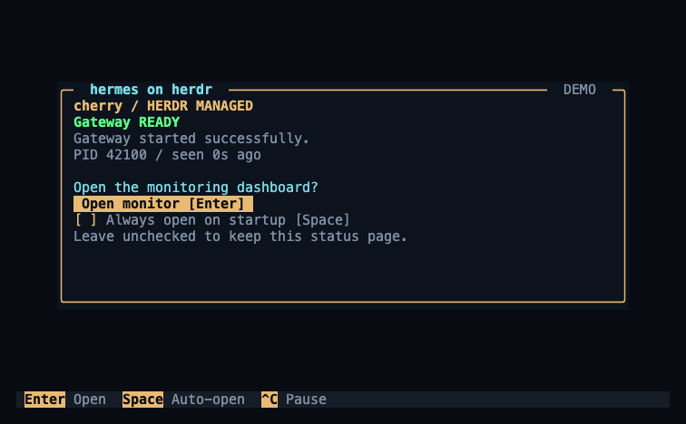

# 14 · hqtui 监控面板

记录日期：2026-09-12。早期独立面板在现有 Herdr pane 中完成只读预览；正式 0.1.0 安装后，嵌入终端监控和独立网页面板均已真实运行，见 [13.7 的进程、画面与健康证据](13-cherry接入与验证.md#137-正式-010-发布安装与运行验收)。

## 14.1 界面与布局

当前版本 `v0.1.0` 显示在启动卡片底边和完整面板右下角；极窄视图也保留版本。它与 CLI `--version`、doctor 和插件 manifest 一致，不增加独立页头或额外采样。

品牌为 **hermes on herdr**。插件启动时在专用 space 中显示简洁的 Gateway 状态页，完整监控默认关闭。按 Enter 或点击 Open monitor 才进入面板；“Always open on startup”默认未勾选，空格或鼠标可勾选并保存，供下次启动使用。单次打开不会自动勾选。取消勾选后，下次恢复为状态页。



两种视图共用一个隔离的终端进程，使用 [hqtui](https://github.com/profullstack/hqtui) 的 Python 实现。依赖固定到 `d9a841494bab910403737a8c791d6d96ef52e878`，以未修改的源码随仓库提供；无需安装 Node 或从 PyPI 下载同名包。[来源、MIT 许可与文件摘要](../vendor/README.md)。


- 1 个 profile：主卡片、主机概况和状态事件。
- 2 个 profile：左侧上下两张卡片，专属卡片占稍多高度；右侧依次为字符图、主机概况和事件。
- 更多 profile：左侧顶部固定 Herdr 专属卡片，下方为可滚动列表；右侧为字符图、主机概况和选中项详情。卡片模式按选中项分页。
- 窄窗口：保留专属 profile 摘要、列表、主机一行概况和常用快捷键。
- Herdr 管理的 profile 始终以金色边框、`HERDR MANAGED` 和 `PINNED` 标识；选择或过滤其他 profile 时仍保留。

其他尺寸预览：[单 profile](evidence/dashboard-one.png)、[20 个 profile](evidence/dashboard-fleet.png)、[80×24 窄窗口](evidence/dashboard-narrow.png)。这些图片由真实 hqtui framebuffer 导出，标有 `DEMO`，内容全部为合成数据。

完整监控不设独立页头。窗口达到 100 列、34 行时，右上 SYSTEM 上方显示用户提供的完整 15 行双蛇杖字符图，保留原有 Unicode 字符和间距。图形只做两秒轻微色彩变化，随后静置十秒；字符形状和位置始终不变。动画表示品牌形象，服务是否健康仍以状态文字为准。窄窗口、帮助页和启动状态页收起图案；失焦时停止动画。`a` 切换静态显示，偏好会被保存。在线数量、LIVE/DEMO 和采样设置位于底栏。

## 14.2 监控范围与数据含义

启动状态页只检查 Herdr 专属 Gateway，不发现其他 profile，也不采集主机指标。显示 READY 前仍执行原生状态与 Herdr 所有权检查；无法确认、连接异常、启动中、暂停或熔断都有明确文字状态。

从插件已绑定 profile 推导 Hermes 根目录，发现同一用户的 `default` 和 `profiles/*`。例如绑定 `~/.hermes/profiles/cherry` 时，覆盖该 `~/.hermes` 下的全部标准 profile。发现过程跳过符号链接、删除标记和不安全目录。独立放在其他 `HERMES_HOME` 根目录中的 profile 需要另行接入，当前不会遍历磁盘寻找它们。

每个 profile 展示 Gateway 状态、PID、运行时间、平台连接、活动 Agent 数、进程 CPU、RSS 和最近观察时间。活动数仅在原生接口提供有效值时显示。

| 标记 | 含义 |
| --- | --- |
| `READY` | 专属 profile 的原生实时状态与 Herdr 所有权检查均通过 |
| `RUNNING` | 外部 profile 的原生接口确认正在运行 |
| `DEGRADED` | 平台连接异常或需要处理 |
| `SHARED` | 由另一个 Gateway 复用服务；显示来源，不重复计算资源和平台连接 |
| `STOPPED` | 没有可确认存活的 Gateway；单凭一个过期 PID 文件不会报告运行 |
| `SCANNING` | 尚未轮询到的 profile |
| `UNKNOWN` / `STALE` | 无法验证或观测过期；隐藏当前连接、CPU、RSS 和活动数，保留明确的状态提示 |

CPU 的 `100%` 表示占满一个逻辑核；RSS 只计算 Gateway 本进程。历史图按最近 90 个观测样本绘制，采样间隔可变。RSS 图使用标出的局部纵轴。事件区保留最近 24 条**观察到的状态变化**，不读取聊天内容或原始日志。

采样不会读取 profile 的 `config.yaml`、`.env`、会话或数据库；原生 socket 只使用 `identify`、`status`。其他 profile 的生命周期仍由各自的启动方式管理。

## 14.3 开销控制

| 项目 | 策略 |
| --- | --- |
| 默认采样 | 2 秒，可调整为 5 或 10 秒 |
| 优先级 | Herdr 专属 profile、当前选中项优先，其余轮询 |
| 每轮工作量 | 最多探测 4 个 profile；每个原生请求上限 150 ms，专属 owner 检查预算 500 ms |
| 目录发现 | 每 30 秒刷新一次 |
| 主机指标 | 仅非阻塞 CPU 利用率与内存概况，可关闭；不扫描全机进程表 |
| 失焦 | 终端支持并发送 focus 事件时，降为 10 秒采样并暂停自动绘制 |
| 默认状态页 | 只检查专属 Gateway；不发现或探测其他 profile，不采集主机指标，不播放动画 |
| 渲染 | 数据、交互或观测年龄变化时重绘监控内容；动画复用一张 hqtui framebuffer，只绘制右侧字符图区域；只输出变化的字符单元 |
| 动画 | 两秒轻微色彩变化、十秒静置；与采样共享一个等待器，使用独立的截止时间，不增加 RPC 或主机指标采样；不订阅无按键的鼠标移动 |
| 并发 | 一个采样线程；嵌入模式另有一个阻塞等待父进程生命周期的线程 |

1–2 个 profile 每轮都能覆盖。大量 profile 的首次完整状态采样和后台刷新会分散到多个周期；选中任意 profile 后，它在下一轮获得优先采样。界面显示观测年龄，过期数据不会继续以健康状态展示。

## 14.4 交互

| 操作 | 效果 |
| --- | --- |
| 状态页中的 Enter / Open monitor | 打开本次监控，不改变下次启动偏好 |
| 状态页中的 Space / 鼠标勾选 | 保存“以后自动打开”偏好；默认关闭，可再次取消 |
| `j/k`、方向键 | 选择 profile |
| `PgUp/PgDn`、`Home/End` | 大步移动，或跳到首尾 |
| 鼠标点击、滚轮 | 选择和滚动列表 |
| `/`、输入名称、`Enter` | 按名称过滤；`Esc` 清除过滤 |
| `l` | 切换自动、卡片、列表布局 |
| `t` | 切换 Herdr、Nord、高对比度、单色主题 |
| `a` | 开关双蛇杖色彩动画；关闭后保留静态原图 |
| `s` | 开关主机指标 |
| `+/-` | 在 2、5、10 秒之间加快／减慢采样 |
| `?` / `F1` | 帮助 |
| `b` | 返回 Gateway 状态页，调整自动打开偏好 |
| 嵌入面板中的 `q` | 返回 Gateway 状态页，Gateway 继续运行 |
| 嵌入面板中的 `Ctrl+C` | 沿用原有 supervisor 契约，持久暂停专属 Gateway |
| 独立监控窗口中的 `q` / `Ctrl+C` | 关闭该监控窗口 |

布局、主题、主机指标开关、采样间隔、动画开关和 `auto_open` 保存在插件配置目录的 `dashboard.json`，权限 `0600`，原子替换。旧偏好文件保留原有设置，缺少的 `auto_open` 默认为 `false`，不会自动启用完整面板；缺少的动画开关默认为开启。过滤内容、选择项和当前页面不持久化。损坏的偏好回退为默认值；符号链接、共享文件或其他不安全目标不会被覆盖。保存失败会提示错误，并恢复自动打开复选框的原值。

## 14.5 生命周期隔离

面板与 Gateway 是 supervisor 的两个独立子进程。Gateway 输出继续由原有日志路径消费，渲染不会进入 Gateway 的输出管道。面板只继承终端显示所需的少量环境变量。

嵌入面板通过专用 socketpair 把 `Ctrl+C` 交给自己的 supervisor，随后由原有持久暂停逻辑处理。它不会搜索父 PID 并发送信号。面板启动失败、异常退出或输出阻塞时，Gateway 的监督与控制仍然可用。父进程退出会关闭生命周期通道，面板即使卡在绘制或采样中也会退出；终端模式恢复使用非阻塞输出。

`TERM=dumb`、非 TTY 或 supervisor 环境设置 `HGH_DASHBOARD=0` 时不自动启动状态页或面板。独立 `dashboard` 命令在输出被重定向时只打印一帧，不持续写 ANSI 控制流。

## 14.6 测试与测量

0.1.0 的完整离线回归 **167 项通过**，见 [完整输出](evidence/release-0.1.0-unittest.txt)，包含 macOS 退出竞态及 HTTP 健康面板。原有面板阶段的 [153 项记录](evidence/dashboard-unittest.txt)及以下资源测量保留。

新增测试覆盖身份伪造和 PID 复用、慢 socket、轮询公平性和上限、共享 Gateway 计数、CPU 时间差及历史长度、1/2/25 个 profile 的多尺寸布局、过滤和滚动定位、偏好文件安全、真实 PTY 输入与 resize、失焦降频、高频按键不加快采样，以及面板退出／崩溃／阻塞对 Gateway 生命周期的隔离。配置和状态文件的 FIFO 回归使用真实 launcher 验证。

真实 PTY 测试验证默认停留在状态页、手动打开不改变默认值、鼠标勾选后下一进程自动打开、键盘取消后下一进程恢复状态页，以及保存失败时不误报已保存。状态页不发现其他 profile、不采样主机指标；从监控返回后恢复这个范围。

动画测试验证真实 PTY 中画面帧增加时采样次数不增加，静态模式和失焦停止额外绘制；渲染测试验证原图完整位于 SYSTEM 上方，动画只改变字符图的颜色。复用画面仍保留鼠标区域，主题、尺寸、选中项、新观测和观测过期都会使缓存失效，过期信息不会继续显示连接成功或当前资源值。状态文件在路径 stat 与 fd 检查期间发生原子替换均有回归覆盖，保留所有权、权限、硬链接和锁校验。

```sh
/absolute/path/to/hermes/venv/bin/python -I -B tests/run.py
```

2026-09-12 在 macOS arm64、Python 3.11.15、160×44 终端上测量同一嵌入终端进程的默认状态页、完整监控和失焦状态，完整监控的双蛇杖色彩动画开启。各阶段测量 20 秒，预热后计数。CPU 包含渲染、采样、原生 RPC 和进程指标读取；内存是该面板进程 RSS。原有 supervisor、被监控服务和测试工具的资源未计入。对端全部使用临时目录与本地假 Gateway：一个由真实 supervisor 代码管理，其余 profile 的协议响应由测试进程提供。

| profile 数 | 状态 | CPU，单核口径 | RSS 中位数 | 终端输出 |
| --- | --- | --- | --- | --- |
| 2 | 默认状态页 | 0.239% | 35.86 MiB | 0 B/s |
| 2 | 完整监控 | 0.582% | 35.92 MiB | 876 B/s |
| 2 | 失焦 | 0.052% | 35.97 MiB | 0 B/s |
| 50 | 默认状态页 | 0.255% | 35.50 MiB | 0 B/s |
| 50 | 完整监控 | 0.914% | 35.58 MiB | 1035 B/s |
| 50 | 失焦 | 0.058% | 35.61 MiB | 0 B/s |

两种规模下，默认状态页对其他 profile 的原生请求均为 **0**。50 profile 的完整监控在这一有限观察窗口内覆盖了 39 个后台 profile，余下按有界轮询继续检查。

同尺寸、90 个历史样本的完整画面重绘中位数：1/2/50/1000 条 profile 分别为 6.03/7.10/8.75/10.16 ms；复用画面后的动画帧分别为 0.78/0.79/0.79/0.78 ms。这两项只测 hqtui framebuffer 构造与绘制，不包括终端编码和输出；上表的完整进程测量包含这些开销。原始数字和测量范围见 [JSON 记录](evidence/dashboard-benchmark.json)。

```sh
/absolute/path/to/hermes/venv/bin/python -I -B tools/dashboard_benchmark.py \
  --profiles 2 50 --seconds 20 --output /tmp/dashboard-benchmark.json
```

## 14.7 查看与启用

不连接真实服务的 HTML 预览：

```sh
/absolute/path/to/hermes/venv/bin/python -I -B tools/dashboard_preview.py \
  --profiles 2 --width 160 --height 44 --output /tmp/hermes-on-herdr.html
```

添加 `--startup` 可预览默认状态页，`--pose 1` 或 `--pose 2` 可导出双蛇杖不同色彩阶段；HTML 是静态 framebuffer 预览，动画在 TTY 中运行。

已有有效插件配置时，可以独立运行演示 TUI；此模式不会构造真实采样器：

```sh
./bin/hermes-on-herdr --config /absolute/config.json dashboard --demo-profiles 2
./bin/hermes-on-herdr --config /absolute/config.json dashboard --demo-profiles 20
```

真实只读监控入口，以及一次性文本／JSON 快照入口：

```sh
./bin/hermes-on-herdr --config /absolute/config.json dashboard
./bin/hermes-on-herdr --config /absolute/config.json dashboard --startup
./bin/hermes-on-herdr --config /absolute/config.json dashboard --snapshot
./bin/hermes-on-herdr --config /absolute/config.json dashboard --json
```

独立 `dashboard` 可在普通 Herdr pane 中打开；`--startup` 复用插件启动时的状态页和自动打开偏好，但保持独立监控的退出语义。独立面板可单独退出并重新打开以加载显示更新，不触发 Gateway 生命周期操作。

## 14.8 本机网页与健康检查

终端面板之外，可在另一个 Herdr pane 中启动独立的只读网页：

```sh
./bin/hermes-on-herdr --config /absolute/config.json dashboard --http-port 8767
curl --fail http://127.0.0.1:8767/health
```

命令保持前台运行，输出实际 URL。页面为 `http://127.0.0.1:8767/`；端口 `0` 会选择空闲端口。此模式不显示 TUI，不能与 `--startup`、`--snapshot`、`--json`、演示或嵌入选项混用。关闭它不会暂停或终止 Gateway；它不会安装系统服务，也不随插件默认启动。

网页只采样配置绑定的 Profile，复用原生身份和 supervisor 归属检查；独立采样器每两秒更新一次，HTTP 请求只读缓存，不增加 Gateway RPC。`/health` 仅在托管状态为 READY、Gateway PID 与 pane 可核验、期望平台全部 connected、采样不超过六秒时返回 **HTTP 200 / healthy=true**。未启动、断连、归属失败、采样失败或过期返回 **503**。页面本身返回 200 不代表 Gateway 健康。

服务只绑定 `127.0.0.1`，启动不做反向 DNS 查询；拒绝外部 Host/Origin，不提供控制接口，不读取或输出凭据。它是本机观察入口；不作为公开网络服务或跨用户认证边界。TUI 的多 Profile 布局与交互不变。

插件状态页在**新的 supervisor 启动时**生效，完整监控是否自动打开由 `auto_open` 决定；只重启 Gateway child 不会加载新的 supervisor 页面代码。正式 0.1.0 的真实 supervisor 已创建一个嵌入 renderer，按 Enter 后核对了完整 LIVE 画面；独立 HTTP 模式的网页及健康接口也返回 200。完整宿主冷启动、退出清理和在线升级 handoff 仍待验证。

品牌和新 checkout 使用 `hermes-on-herdr`，稳定的 plugin ID、配置目录和控制协议保持不变。开发目录重命名的兼容符号链接只处理路径一致性，相关兼容和错误目录拒绝已有回归测试；它不会把开发 link 变成正式安装。从开发 link 迁入 Release 或升级发布版本时，按[发布与安装](15-发布与安装.md)完成停止、来源替换和验证，再启动新 supervisor 与独立面板。

返回 [文档索引](README.md) · [cherry 接入记录](13-cherry接入与验证.md)。
