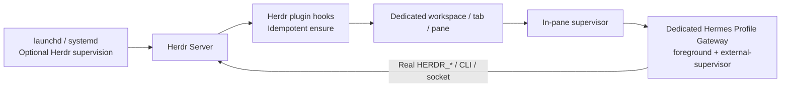

<p align="center">
  
</p>
<h1 align="center">hermes on herdr</h1>
<p align="center">Supervise a dedicated Hermes Gateway inside a real Herdr pane, with explicit run intent and process ownership.</p>
<p align="center"><a href="../README.md">简体中文</a></p>

## What it does

This Herdr plugin implementation aims to ensure that one dedicated Hermes Gateway runs inside its owning Herdr pane. The Gateway inherits the actual `HERDR_SOCKET_PATH`, `HERDR_WORKSPACE_ID`, `HERDR_TAB_ID` and `HERDR_PANE_ID`, so it can act as a control agent for that session.

**Current status: the core, startup status page and optional hqtui dashboard are implemented; 153 offline tests pass.** The plugin first shows its managed Gateway status. Press Enter to open monitoring; “Always open on startup” is unchecked by default and can be saved with Space or a mouse click. The full dashboard places the Hermes caduceus above SYSTEM, adapts to small and large profile collections and pins the Herdr-managed profile. Layouts, themes, animation and sampling frequency are adjustable. See [previews, controls and resource measurements](14-hqtui监控面板.md).

Cherry previously reached READY under plugin supervision, and the user confirmed message connectivity. The native LaunchAgent remains removed. A standalone dashboard has been previewed in an adjacent Herdr pane with cherry and default online. Herdr and cherry were not stopped or restarted. Embedded activation, cold-start, shutdown and explicit pane interaction checks still require confirmation before live validation; see the [cherry record](13-cherry接入与验证.md).


## Features

- Persistent start/pause intent, singleton locks, revision checks and request deduplication.
- A controller that checks live identity and its own ledger before creating a workspace or pane. Unknown launch outcomes and live orphans block replacement instances.
- A pane supervisor with one child, bounded retry/backoff, persistent circuit breaking and verified process identity before signaling.
- JSON diagnostics through `status`, `doctor` and `logs`.
- A binding plan for an existing dedicated Profile; `bind` defaults to a dry run. Explicit Start/Resume allows running, while Pause/Stop persists the stopped intent before notifying the supervisor.
- A development manifest for Herdr startup, events, actions and the Gateway pane.
- An isolated hqtui companion with profile cards, scrolling tables, CPU/RSS graphs, lightweight host metrics and persistent presentation preferences.

A new-Profile initializer, automatic orphan recovery, maintenance/upgrade tools and operating-system services are not implemented. `stop --wait` does not report an orphan or unknown launch as successfully stopped.

## Usage and development

The current delivery includes the core implementation and a development manifest, with real cherry validation in progress. Read the [configuration examples](../examples/README.md) and [real-environment validation plan](05-实现步骤.md) before preparing a separate test session, dedicated Profile and configuration. There is no one-step installation or automatic Profile creation.

The launcher help requires no configuration and does not connect to Herdr or Hermes:

```sh
./bin/hermes-on-herdr --help
```

Use Python 3.11 or newer from the configured Hermes virtual environment, with the dependencies in [requirements.txt](../requirements.txt). The launcher first uses OS Python to validate the private interpreter hint, then starts the selected venv Python in isolated mode. The configuration directory must have mode `0700`; `config.json` and `runtime-python` must have mode `0600`. The interpreter hint contains one absolute path matching `python_bin`.

After preparing a reviewed, separate configuration, these commands read status or show a binding plan. Replace the placeholder path with that configuration:

```sh
./bin/hermes-on-herdr --config /absolute/config.json status --json
./bin/hermes-on-herdr --config /absolute/config.json doctor --json
./bin/hermes-on-herdr --config /absolute/config.json bind --dry-run
```

| Command | Behavior |
| --- | --- |
| `bind` / `bind --dry-run` | Show the control-directory plan for an existing dedicated Profile |
| `bind --apply` | Initialize control state as paused; do not create a Profile or start the Gateway |
| `start` / `resume` | Explicitly allow running, then ensure; an ACK is not proof of readiness |
| `pause` / `stop` | Persist paused intent, then notify the supervisor |
| `stop --wait 30` | Wait up to 30 seconds and verify completion before reporting stopped |
| `restart` | Request a restart only when running is allowed; never implicitly resume |
| `status --require-ready` | Succeed only for verified READY; this does not prove model or bot-message operation |
| `logs --lines 50` | Read structured lifecycle events without exporting raw child output |
| `dashboard` | Open a standalone read-only monitor; print one frame outside a TTY |
| `dashboard --startup` | Show startup status and offer monitoring, respecting the saved auto-open choice |
| `dashboard --snapshot` / `dashboard --json` | Print one text or JSON monitoring snapshot |
| `dashboard --demo-profiles 2` | Preview synthetic data without sampling real profiles |

Herdr hooks use `ensure`; the real pane uses `supervise`. Manual control outside a hook supplies the bound owner through the global `--owner-socket /absolute/bound.sock` option. The [command contract](12-离线实现与验证.md#124-当前命令契约) documents all flags, exit codes and retry rules.

## Tests

Run isolated tests with the configured Hermes venv Python:

```sh
/absolute/path/to/hermes/venv/bin/python -I -B tests/run.py
```

Tests use temporary directories, fake Herdr RPC and controlled Python Gateway fixtures. They do not import Hermes main or invoke installed Herdr/Hermes entry points. Scenarios cover concurrent creation, lost responses, process exits, pause races, PID reuse, background-process cleanup and log backpressure.

The [153-test output](evidence/dashboard-unittest.txt) includes bounded multi-profile sampling, animation and sampling isolation, cached frame invalidation, persistent startup opt-in and opt-out across processes, atomic state replacement races, real PTY input and renderer failure isolation. The [dashboard record](14-hqtui监控面板.md) includes reproducible resource measurements. The initial [84-test run](evidence/offline-unittest.txt) and [90-test cherry integration run](13-cherry接入与验证.md) remain available as historical evidence. Linux and live handoff remain unverified.

## Stack

| Technology | Role |
| --- | --- |
| Python / standard-library unittest | Controller, supervisor, CLI and offline fault tests |
| Unix sockets / JSONL | Bounded Herdr and Hermes control exchanges |
| flock / atomic JSON files | Singleton locks, persistent intent, revisions and request deduplication |
| psutil | Process identity and verified descendant inspection |
| hqtui / Python | Adaptive terminal panels, graphs, incremental rendering and input; pinned source is vendored |
| PyYAML | Dedicated Hermes Profile configuration checks |
| Herdr plugin TOML | Development startup, events, actions and pane registration |

## Architecture

The design is feasible with constraints. The recommended ownership chain is:



- Herdr v0.9.0 provides argv plugin panes and real environment injection. Startup hooks launch commands asynchronously; they are not process supervisors. [H03–H04](09-源码证据索引.md#h03)
- One dedicated `herdr-control` Profile on the same machine and OS user binds to one configured session. Other sessions do not compete for it. Multiple Gateways require separate Profiles, platform tokens and ownership. [Decisions](08-决策记录.md)
- The pinned Hermes version provides `gateway.sock`. Identity, live status and connected expected platforms support a minimal readiness probe, but do not prove model calls or end-to-end messaging. [M10–M11](09-源码证据索引.md#m10)
- Cold restore does not replay saved ordinary launch argv. Live handoff may preserve PTY/process state but loses in-memory plugin ownership and reruns startup hooks. Deduplication therefore uses locks, live identity and the plugin ledger rather than pane labels alone. [H07–H09](09-源码证据索引.md#h07)
- Stop/Pause persists; only explicit Start/Resume clears it. Exit handling for restart 75, retry 1, stop 0 and circuit-break 2/78 must also respect persisted intent. [Lifecycle](03-生命周期设计.md)
- A Herdr crash may interrupt the Gateway; recovery recreates it after Herdr returns. A failed supervisor after handoff may produce no exit event, so unattended recovery with a deadline also needs periodic short ensures. Live handoff under a native service manager remains unsupported until tested. [Limits](01-可行性分析.md)

A Profile isolates state; it is not a sandbox. An agent with the real Herdr socket and local terminal execution has broad same-UID capabilities. A persona does not create a hard resource boundary. See [security and operations](07-安全与运维.md).

## Documentation

The detailed design and evidence documents are in Chinese.

| Document | Contents |
| --- | --- |
| [Index](README.md) | Reading order, evidence levels and terminology |
| [01 · Feasibility](01-可行性分析.md) | Source review, prior art, alternatives and risks |
| [02 · Architecture](02-系统架构.md) | Components, ownership, protocols, schemas and state machine |
| [03 · Lifecycle](03-生命周期设计.md) | Ensure, recovery, restart, pause and uninstall design |
| [04 · Dedicated Profile](04-Hermes专用Profile设计.md) | Initialization, configuration, persona, skills and credentials |
| [05 · Implementation plan](05-实现步骤.md) | Integration spikes, phases and acceptance |
| [06 · Testing](06-测试与验证.md) | Unit, integration, end-to-end and fault-injection matrix |
| [07 · Security and operations](07-安全与运维.md) | Permissions, logs, troubleshooting, services and upgrades |
| [08 · Decisions](08-决策记录.md) | Architecture decisions and reversal criteria |
| [09 · Source evidence](09-源码证据索引.md) | Commits, paths, symbols, official docs and research |
| [10 · Task list](10-实施任务清单.md) | Priorities, dependencies and completion criteria |
| [11 · Research record](11-研究与验证记录.md) | Completed research and document checks |
| [12 · Offline implementation](12-离线实现与验证.md) | Implemented commands, test evidence, limits and remaining validation |
| [13 · Cherry integration](13-cherry接入与验证.md) | Native shutdown, configuration, restart fixes, live READY and user-confirmed messaging |
| [14 · hqtui dashboard](14-hqtui监控面板.md) | Layouts, sampling, controls, PTY tests, resource measurements and activation |

## Pinned baseline

| Component | Version | Source commit |
| --- | --- | --- |
| Herdr | v0.9.0 | [`b99002ac99b09e00b4ca692436cb15a6b0d676f1`](https://github.com/herdrdev/herdr/tree/b99002ac99b09e00b4ca692436cb15a6b0d676f1) |
| Hermes Agent | v0.21.1 (2026.9.7) | [`b7ac3ba1cdf89f94dfe86de27e01358b194f4053`](https://github.com/NousResearch/hermes-agent/tree/b7ac3ba1cdf89f94dfe86de27e01358b194f4053) |
| Official documentation | Retrieved 2026-09-11 | Unversioned; differences from source are documented |

Six local reference implementations and additional candidates are pinned in the [evidence index](09-源码证据索引.md). The research did not find a public exact-match plugin within its documented scope; this is not proof that none exists.

## Scope

The host integration is a **Herdr plugin**, registered through `herdr-plugin.toml`. Hermes Python plugins use `plugin.yaml` and load inside Hermes; the lifecycle design does not depend on adding one.

The first version targets host macOS/Linux, one user, one machine and one explicitly bound session. Windows, cross-machine high availability, hot migration of bot tokens, keeping the Gateway available without Herdr, and strong isolation from arbitrary malicious local code are outside that scope. Local integration changes cover plugin installation and configuration, the cherry Profile and its native LaunchAgent. Other Profiles and upstream Hermes/Herdr source code remain unchanged.

The repository follows the observed `<thing>-herdr` naming pattern. Its development manifest uses ID `nocoo.hermes-gateway` and pane entry `gateway`; these identifiers do not need to match the repository name.

Next, complete the cold-start, shutdown-cleanup and explicit pane interaction checks in the [cherry acceptance record](13-cherry接入与验证.md), then review the [P0 validation checklist](05-实现步骤.md). Further service stops performed by the agent require user confirmation. Configuration templates are in [examples](../examples/README.md).

The brand is **hermes on herdr** and the repository is [`nocoo/hermes-on-herdr`](https://github.com/nocoo/hermes-on-herdr). The canonical launcher is `bin/hermes-on-herdr`; `bin/hermes-gateway-herdr` remains a compatibility alias. Existing installations retain the `nocoo.hermes-gateway` plugin ID and `gateway` entrypoint.
