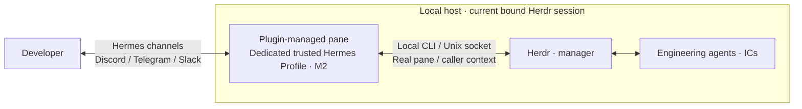

<p align="center">
  
</p>
<h1 align="center">hermes on herdr</h1>
<p align="center">Connect a trusted Hermes to your Herdr session. Manage your agent team through the chat channels you already use.</p>
<p align="center"><a href="../README.md">简体中文</a> · <a href="README.md">Documentation</a> · <a href="../examples/README.md">Configuration</a></p>

## What it does

**hermes on herdr** is a Herdr plugin that links a dedicated Hermes Profile you explicitly choose and trust to your current Herdr session. Its Gateway runs in a managed pane with that session's real pane, socket and caller context, giving it full Herdr control within the bound session. Hermes becomes your M2: it manages Herdr, and Herdr manages your engineering agents.

Hermes's existing Discord, Telegram, Slack and other channels connect you to that M2. Once a channel is configured, you can assign work, check progress and adjust priorities while away, without first logging in over SSH, opening a remote desktop, or setting up a VPN or exposed control port for Herdr. Messages use the existing channel; the Herdr control connection stays local.

https://github.com/user-attachments/assets/c19ff537-9637-44bf-a9ba-3b4f4a6ce065

You already have engineering agents such as Codex, Grok, Pi and Claude Code working in Herdr. When you want Hermes to manage Herdr, the missing piece is control context. A Hermes instance running independently outside Herdr does not automatically belong to the target session's managed pane, socket or caller context. Being able to message it does not establish a verifiable Herdr identity, control target or process owner. An external instance needs those relationships set up and maintained separately.

The plugin makes that connection explicit. You select an existing trusted Profile and bind it to the current owner session. Herdr creates a real plugin pane; the plugin verifies ownership, and a supervisor runs the dedicated Gateway there with the correct control context. That Hermes can manage the session through the local Herdr CLI/API, with clear ownership of Gateway startup, shutdown, pause and recovery.

Hermes's existing channels handle the connection between you and M2, removing host logins, desktop access and control tunnels from everyday remote management. The host, Herdr and the dedicated Gateway must remain online, with access to the selected messaging and model services. You configure channel credentials and authorized messaging identities. See [Development and validation](#tests) for the actual platform and end-to-end verification scope.

## Features

Since `v0.1.2`, the plugin keeps the full dashboard open by default and includes an independent recovery screen.


- Herdr restores the dedicated `hermes on herdr` tab with the full dashboard open. Detach / reattach keeps the dashboard; persisted run intent starts the Gateway automatically.
- Pausing the Gateway, a failed startup or a tripped circuit breaker leaves the dashboard available. Click **Start** or press **Enter** to start or retry. Failed configuration checks retry automatically every 30 seconds.
- Monitor multiple Hermes Profiles, including status, CPU, memory and process trends, with the Herdr-managed instance highlighted. Adjust the layout, theme, animation and sampling interval; the default is two seconds.
- Manage the Gateway with `start`, `pause`, `resume`, `stop` and `restart`. Read JSON diagnostics through `status`, `doctor` and `logs`.
- The supervisor uses singleton locks, identity checks, bounded retries and circuit breaking. Unknown launch outcomes and live orphan processes are preserved for diagnosis before replacement.

See the [dashboard guide](14-hqtui监控面板.md) for previews, controls and resource measurements.

### Architecture and trust boundaries



- The binding is defined by the dedicated Profile and owner socket you explicitly choose. Installing the plugin does not authorize arbitrary external Hermes instances or take over other Profiles. The plugin checks the binding, pane membership and process identity at startup and during operation, rejecting a mismatched owner context.
- “Full control” means Herdr API control of the bound session. Herdr's local socket permissions and the plugin's ownership checks and lifecycle rules still apply. Paused intent persists until an explicit resume.
- Remote messaging uses Hermes's existing platform authentication and access policies. Configure the channel's user allowlist or pairing mechanism for the dedicated Profile so only authorized messaging identities can reach M2. The plugin does not automatically provision bots, credentials or user authorization.
- Herdr's Unix socket is not exposed publicly. Discord and Slack connections, and Telegram polling, can reach the existing messaging services without a direct connection from your device to the Herdr host. The optional HTTP monitor also binds only to `127.0.0.1`; it is read-only and cannot control the Gateway.

The session binding defines the plugin's owner, default control target and supported operating scope; **it is not an OS sandbox**. Hermes's local terminal retains the host user's UID permissions. The Herdr socket has no fine-grained per-pane or per-Profile ACL, and a Profile, prompt or skill cannot enforce isolation from other resources accessible to that UID. This requires an explicitly trusted Profile; it is not an isolation container for an untrusted agent.

See the [context and Profile checks](../src/hermes_gateway_herdr/config.py), [Herdr permission evidence](09-源码证据索引.md#h11), [Hermes platform implementations](https://github.com/NousResearch/hermes-agent/tree/b7ac3ba1cdf89f94dfe86de27e01358b194f4053/plugins/platforms) and [security and operations guide](07-安全与运维.md) for the implementation and its constraints.

## Usage

**0.1.4** uses Herdr's native plugin installer; see the [GitHub Release](https://github.com/nocoo/hermes-on-herdr/releases/tag/v0.1.4) and [release guide](15-发布与安装.md) for distribution, installation and upgrades. The [first-run association wizard](16-首次安装与Profile关联.md) is planned. Manual configuration and `bind` are implemented.

This is an early 0.x release. Use Python 3.11+ from a configured Hermes virtual environment with [psutil and PyYAML](../requirements.txt). The repository includes pinned hqtui source. Herdr installation requires at least 0.9.0. Runtime checks validate the actual JSON API and pane ownership without an upper release bound or a binary wire protocol pin. The 0.9.0 and 0.9.1 interfaces have been checked. Hermes Agent remains pinned to its v0.21.1 source commit. See the [compatibility policy and evidence](18-Herdr兼容策略.md).

```sh
herdr plugin install nocoo/hermes-on-herdr --ref v0.1.4
herdr plugin config-dir nocoo.hermes-gateway
herdr plugin list --plugin nocoo.hermes-gateway --json
```

Enter the returned `plugin_root`; `./bin/hermes-on-herdr --help` and `--version` need no configuration. Follow the [configuration examples](../examples/README.md) and [installation guide](15-发布与安装.md) to prepare the target Herdr session, an existing dedicated Hermes Profile and private plugin configuration. Installing the plugin does not download Python dependencies or take over an existing Gateway. The user configures the Profile's model, credentials and platforms.

Once configured, replace the placeholder with your actual `config.json`:

```sh
./bin/hermes-on-herdr --config /absolute/config.json status --json
./bin/hermes-on-herdr --config /absolute/config.json doctor --json
./bin/hermes-on-herdr --config /absolute/config.json bind --dry-run
./bin/hermes-on-herdr --config /absolute/config.json dashboard
```

The configuration directory uses mode `0700`; `config.json` and `runtime-python` use `0600`. The interpreter hint contains one absolute path matching `python_bin`.

### Everyday commands

Append these commands to `./bin/hermes-on-herdr --config /absolute/config.json`:

| Command | Behavior |
| --- | --- |
| `bind --dry-run` | Show the binding plan for an existing dedicated Profile; also the default for `bind` |
| `bind --apply` | Create paused control state; an explicit `start` then permits running |
| `start` / `resume` | Save run intent and ensure the Gateway; check READY after the ACK |
| `pause` / `stop` | Persist paused intent, then stop the Gateway while keeping the dashboard open |
| `stop --wait 30` | Wait up to 30 seconds for the Gateway and owned descendants to exit; retain the supervisor and dashboard |
| `restart` | Request a restart for an allowed instance, preserving paused intent |
| `status --require-ready` | Succeed only when identity, runtime state and expected platforms satisfy READY |
| `logs --lines 50` | Read structured lifecycle events |
| `monitor` | Restore and focus the dedicated dashboard, preserving paused Gateway intent |
| `dashboard` | Open an independent read-only monitor; `q` exits without affecting the Gateway |
| `dashboard --snapshot` / `dashboard --json` | Print one text or JSON monitoring snapshot |
| `dashboard --demo-profiles 2` | Preview a two-Profile dashboard with synthetic data |
| `dashboard --http-port 8767` | Serve a separate read-only page at `http://127.0.0.1:8767/` and `/health`; no Gateway control |

For control commands outside a hook, supply the bound owner with the global `--owner-socket /absolute/bound.sock` option. The [command contract](12-离线实现与验证.md#124-当前命令契约) covers all flags, exit codes and retry rules.

To return to the persistent dashboard through Herdr:

```sh
herdr plugin action invoke monitor --plugin nocoo.hermes-gateway
```

After installing the [shell shortcut](15-发布与安装.md#恢复命令的安装), run `hermes-on-herdr` with no arguments to open recovery, diagnose problems, restore the dashboard or start the Gateway. Herdr's command palette exposes **hermes on herdr: Recovery & Repair**. System Python runs recovery even when the configured runtime or configuration is broken; persisted tab and pane labels retain the recovery command. See [recovery behavior and limits](14-hqtui监控面板.md#149-故障恢复入口).

After installing the shell shortcut, open recovery with:

```sh
hermes-on-herdr
```

## Development

Requires Python 3.11+. Reuse a dedicated Hermes virtual environment; additional dependencies are listed in `requirements.txt`. Startup does not install dependencies automatically.

```sh
git clone https://github.com/nocoo/hermes-on-herdr.git
cd hermes-on-herdr
```

## Tests

```sh
/absolute/path/to/hermes/venv/bin/python -I -B tests/run.py
```

Tests use temporary directories, fake Herdr RPC, controlled Gateway processes and real PTYs. They do not invoke installed Herdr/Hermes entry points. The [offline test record](evidence/release-0.1.4-unittest.txt) covers the persistent dashboard, recovery, lifecycle races, control and configuration boundaries, process identity and HTTP health checks. [Recovery validation](evidence/recovery-validation.txt) separately records isolated native Herdr popup and label restoration checks, plus an earlier intermittent FIFO CLI timeout whose cause remains unknown. [CI](../.github/workflows/tests.yml) runs Ubuntu / macOS with Python 3.11 / 3.14. The [quality assessment](17-插件质量评估.md) retains the 0.1.1 coverage baseline; resource measurements are in the [dashboard guide](14-hqtui监控面板.md#146-测试与测量).

The [recorded v0.1.0 acceptance](13-cherry接入与验证.md#137-正式-010-发布安装与运行验收) verified an official installation, Cherry READY, exactly one Gateway under Herdr/plugin ownership, Discord connected, the embedded terminal monitor, and HTTP health 200. These are historical runtime snapshots. Telegram and Slack are existing upstream Hermes channels; this plugin has no recorded live integration verification for them yet. A fresh message/model round trip, full host cold start and shutdown, explicit pane interaction, Linux live integration, and live Herdr update handoff remain unverified. The earlier user confirmation of messaging is preserved as historical evidence.

The [local v0.1.1 upgrade record](13-cherry接入与验证.md#138-011-升级与运行观察) includes a supervisor exit with UNKNOWN and a verified recovery. Subsequent checks showed READY, Discord connected and HTTP health 200; a 90-second observation found no further errors. The exit's cause remains unidentified, so this is not a claim of long-term stability.

## Stack

| Technology | Role |
| --- | --- |
| Python | Plugin, lifecycle management and recovery |
| Herdr CLI / RPC | Pane and agent control within the current session |
| Hermes Gateway | Configured message channels and model access |
| hqtui | Local monitoring interface |
| unittest / PTY | Isolated process, RPC and terminal tests |

## Documentation

Detailed guides and research records are in Chinese.

- [Documentation index](README.md): routes for users, developers and research, with current validation scope.
- [Configuration examples](../examples/README.md): interpreter, dedicated Profile, private paths and binding.
- [Dashboard guide](14-hqtui监控面板.md): recovery, Gateway controls, layouts, sampling and performance.
- [Security and operations](07-安全与运维.md): permissions, diagnostics, pause and upgrade boundaries.
- [Architecture](02-系统架构.md) and [lifecycle](03-生命周期设计.md): controller, supervisor, locks and recovery.
- [Brand identity](../assets/brand/README.md): logo usage, original source and Hexly presentation.

The brand is **hermes on herdr**. The repository and command are named `hermes-on-herdr`; internal identifiers and historical names are documented in the [naming conventions](README.md#命名约定).

## License

The repository has no project-level LICENSE. Bundled hqtui retains [its own license](../vendor/hqtui/LICENSE).
